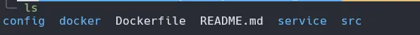
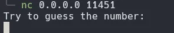
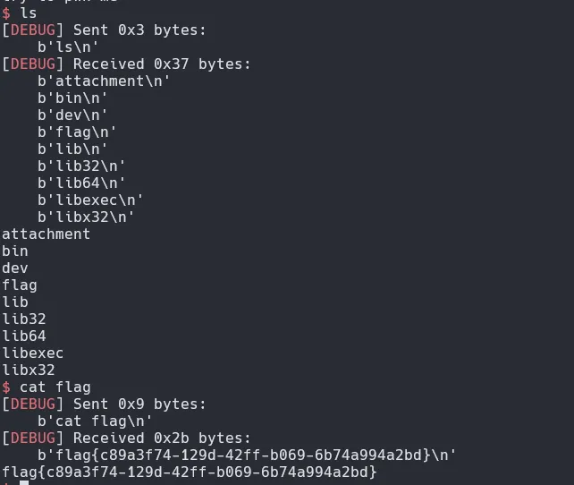
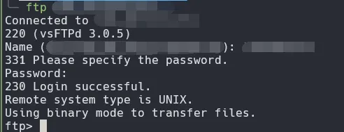
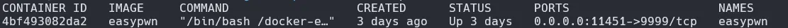
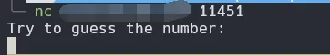

# 出题

## 本地

简单学习了一下如何使用docker出pwn题，使用的模板是[ctf-docker-template](https://github.com/CTF-Archives/ctf-docker-template)

~~~bash
git clone https://github.com/CTF-Archives/ctf-docker-template.git
~~~

目录下有各种容器，我们选择需要使用的版本即可，我这里选择22.04

在22.04的目录下存在这些文件，我们目前只需要知道src用以存放elf文件，我们编译好丢入程序，再使用如下指令创建镜像和容器

~~~bash
docker build [name] .
docker run -d -p "0.0.0.0:[Port]:9999" -h "[name]" --name="[name]" [name]
~~~

容器开启后如下

还可以进行nc连接

此时就可以正常攻击了，但只有本地可连接且flag为静态。我们先解决flag静态的问题，我这里想着flag一般为uuid，所以就使用了uuidgen指令，这个需要安装在docker容器上，所以需要修改Dockerfile和service里的文件

Dockerfile:

~~~Dockerfile
......
RUN apt-get update && apt-get -y dist-upgrade && \
    apt-get install -y lib32z1 xinetd
RUN apt-get install -y uuid-runtime #加上这句
# 新建用户，并进行账户改变
RUN useradd -m ctf
WORKDIR /home/ctf
......
~~~

service:

~~~bash
#!/bin/sh

# Get the user
user=$(ls /home)

# Check the environment variables for the flag and assign to INSERT_FLAG
if [ "$DASFLAG" ]; then
	INSERT_FLAG="$DASFLAG"
	export DASFLAG=no_FLAG
	DASFLAG=no_FLAG
elif [ "$FLAG" ]; then
	INSERT_FLAG="$FLAG"
	export FLAG=no_FLAG
	FLAG=no_FLAG
elif [ "$GZCTF_FLAG" ]; then
	INSERT_FLAG="$GZCTF_FLAG"
	export GZCTF_FLAG=no_FLAG
	GZCTF_FLAG=no_FLAG
else #修改这个else语句
	random_uuid=$(uuidgen)
	INSERT_FLAG="flag{random_uuid}"
fi

# 将FLAG写入文件 请根据需要修改
echo $INSERT_FLAG | tee /home/$user/flag

# 赋予程序运行权限
chmod 711 /home/ctf/attachment

/etc/init.d/xinetd start
sleep infinity
~~~

最后flag就会是一个动态uuid，每次开启容器时自动生成

## 部署

部署到服务器首先需要一台服务器，然后打开ftp服务，ftp服务可以参考云服务提供商的文档，比较冗长就不写了。

能这样连上且具有发送权限就算成功了，接着我们需要导出docker容器

~~~bash
docker ps -a #查看container信息
docker export [CONTAINER ID] > [name].tar
~~~

导出后会看到一个tar文件

ftp连上服务器发送这个文件即可

接着连接进服务器，在服务器的ftp目录下使用这两个指令开启docker容器即可

最后还有一步就是打开云服务器的端口，随后就能通过服务器的公网ip进行nc连接了

