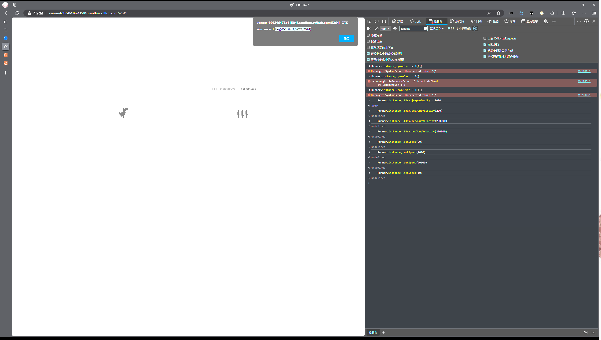
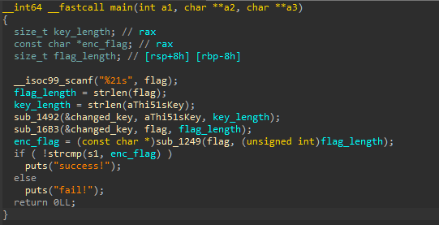
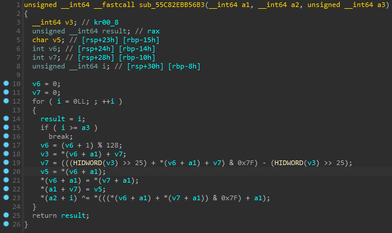

# VenomCTF

## Misc 

### checkin

打开容器,是谷歌的小恐龙界面，并提示我们拿到114514分来获取flag

F12打开控制台,输入

~~~js
Runner.instance_.setSpeed(10000)
~~~

只要速度够快就不会碰撞到物体，等到分数足够，在控制台输入

~~~js
Runner.instance_.setSpeed(10)
~~~

把速度调低，让游戏结束刷新分数

    flag{We1c0m3_VCTF_2024}

### ezmisc

给了一个键盘敲击的音频，和前7个字母welcome，顺着这个线索，找到了一个GitHub库

- [kbd-audio](https://github.com/ggerganov/kbd-audio?tab=readme-ov-file)

通过对按键频率的机器学习来得到键盘键入的字符，但最后没有试出来。

## Crypto

### 狂飙 

打开附件

~~~python
import os
from flag import flag
from Crypto.Util.number import *
from Crypto.Cipher import AES
m = 88007513702424243702066490849596817304827839547007641526433597788800212065249
key = os.urandom(24)
key = bytes_to_long(key)
n=m % key
flag += (16 - len(flag) % 16) * b'\x00'
iv = os.urandom(16)
aes = AES.new(key,AES.MODE_CBC,iv)
enc_flag = aes.encrypt(flag)

print(n)
print(enc_flag)
print(iv)

#103560843006078708944833658339172896192389513625588
#b'\xfc\x87\xcb\x8e\x9d\x1a\x17\x86\xd9~\x16)\xbfU\x98D\xfe\x8f\xde\x9c\xb0\xd1\x9e\xe7\xa7\xefiY\x95C\x14\x13C@j1\x9d\x08\xd9\xe7W>F2\x96cm\xeb'
#b'UN\x1d\xe2r<\x1db\x00\xdb\x9a\x84\x1e\x82\xf0\x86'
~~~

逻辑不难，生成24位key和一个16位向量iv对flag进行加密

注意**n=m % key**，题目中存在m和n所以可以尝试爆破key，脚本如下：

~~~python
import os
#from flag import flag
from Crypto.Util.number import *
from Crypto.Cipher import AES

iv = b'UN\x1d\xe2r<\x1db\x00\xdb\x9a\x84\x1e\x82\xf0\x86'
enc_flag = b'\xfc\x87\xcb\x8e\x9d\x1a\x17\x86\xd9~\x16)\xbfU\x98D\xfe\x8f\xde\x9c\xb0\xd1\x9e\xe7\xa7\xefiY\x95C\x14\x13C@j1\x9d\x08\xd9\xe7W>F2\x96cm\xeb'
n = 103560843006078708944833658339172896192389513625588
m = 88007513702424243702066490849596817304827839547007641526433597788800212065249

tmp = m-n

for i in range(1,200):
    if tmp%i == 0:
        key = tmp//i
        key = long_to_bytes(key)
        aes = AES.new(key,AES.MODE_CBC,iv)
        flag = aes.decrypt(enc_flag)
        print(flag if b'flag' in flag)
~~~

思路上应该没问题，但比赛最后到都没出结果XD，赛后发现是分解问题

~~~python
from Crypto.Util.number import *
from Crypto.Cipher import AES

iv = b'UN\x1d\xe2r<\x1db\x00\xdb\x9a\x84\x1e\x82\xf0\x86'
enc_flag = b'\xfc\x87\xcb\x8e\x9d\x1a\x17\x86\xd9~\x16)\xbfU\x98D\xfe\x8f\xde\x9c\xb0\xd1\x9e\xe7\xa7\xefiY\x95C\x14\x13C@j1\x9d\x08\xd9\xe7W>F2\x96cm\xeb'
n = 103560843006078708944833658339172896192389513625588
m = 88007513702424243702066490849596817304827839547007641526433597788800212065249

tmp = m-n
div = divisors(tmp)
for i in div:
    if 180 < i.nbits() <= 192
        key = long_to_bytes(i)
        aes = AES.new(key,AES.MODE_CBC,iv)
        flag = aes.decrypt(enc_flag)
        print(flag if b'flag' in flag else '',end="")
~~~

    flag{cf735a4d-f9d9-5110-8a73-5017fc39b1b0}

## Reverse

### ezre

将附件丢入IDA,查看main函数，整理后如下：

程序先要求我们输入flag，然后得到flag和加密前的key的长度，再通过**sub_1492**对key进行修改得到新的key，使用修改后的key进入**sub_16B2**加密flag，最后对进行一次base64加密。

由于changed_key不显示，我们直接在**sub_16B2**处下断点进行远程动调，得到修改后的key

~~~c
unsigned char changed_key[] =
{
  0x54, 0x0D, 0x08, 0x60, 0x14, 0x2C, 0x41, 0x2A, 0x30, 0x2E, 
  0x1C, 0x66, 0x1B, 0x47, 0x32, 0x74, 0x65, 0x05, 0x68, 0x7E, 
  0x23, 0x24, 0x52, 0x5C, 0x48, 0x71, 0x11, 0x21, 0x25, 0x04, 
  0x3E, 0x4D, 0x5B, 0x4C, 0x17, 0x29, 0x78, 0x45, 0x00, 0x3C, 
  0x7B, 0x6B, 0x6A, 0x5A, 0x50, 0x61, 0x19, 0x15, 0x73, 0x7D, 
  0x75, 0x43, 0x3D, 0x3A, 0x70, 0x16, 0x77, 0x0C, 0x67, 0x51, 
  0x6F, 0x03, 0x6D, 0x58, 0x4E, 0x37, 0x12, 0x2D, 0x4A, 0x1A, 
  0x4F, 0x5F, 0x4B, 0x7C, 0x55, 0x0F, 0x1D, 0x0E, 0x31, 0x6E, 
  0x79, 0x1E, 0x22, 0x36, 0x69, 0x7A, 0x28, 0x26, 0x53, 0x56, 
  0x0B, 0x63, 0x5E, 0x64, 0x72, 0x3B, 0x5D, 0x0A, 0x42, 0x01, 
  0x2F, 0x13, 0x09, 0x46, 0x3F, 0x6C, 0x7F, 0x44, 0x1F, 0x34, 
  0x18, 0x57, 0x20, 0x39, 0x38, 0x02, 0x76, 0x10, 0x59, 0x49, 
  0x07, 0x27, 0x40, 0x2B, 0x35, 0x33, 0x62, 0x06
};
~~~

再看**sub_16B2**函数

可以看出是先对修改后的key做了某些操作，再对flag异或了某个值，由于布尔环，所以也可以得到脚本，但最后没有实现成功XD，所以不放出来了。