# XYCTF Week1

## Misc

### Game

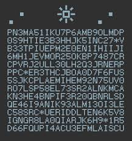

由于我这辈子被电子游戏害了，所以一眼出来 请出示证件，也就是 Papers, Please

### ez_隐写

最外面一层是伪加密，直接使用binwalk提取文件，得到一个hint图片和第二层压缩包，图片一开始打不开，改高度拿到hint：密码是比赛日期。20240401。拿到第二层压缩包内的图片，再提取盲水印。

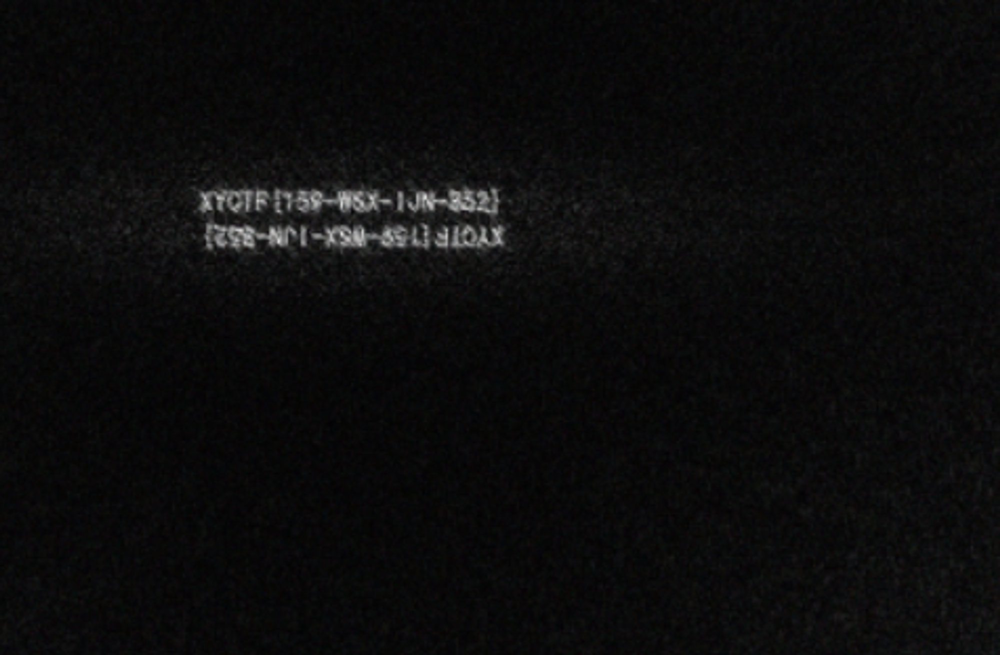

    XYCTF{159-WSX-IJN-852}

### zzl的护理小课堂

打开靶机，直接看源代码部分，可以发现不用做题，只需要构造POST请求flag即可

~~~js

~~~

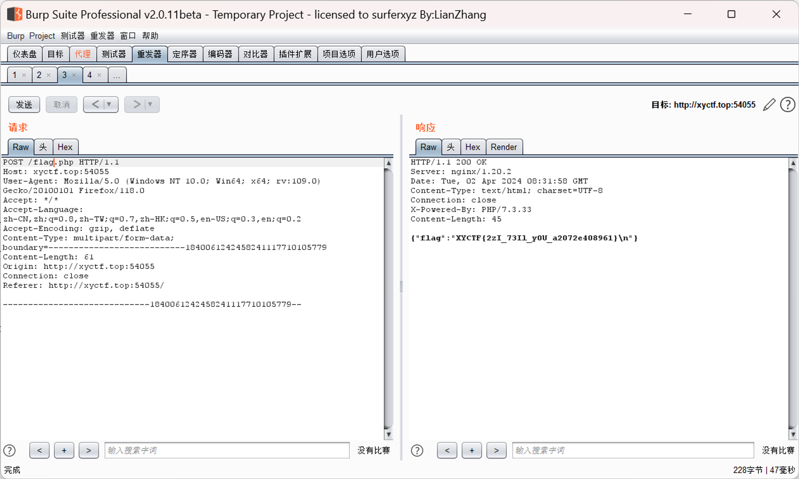

### ZIP神之套

将exe文件丢入IDA,得到一串xyctf????????ftcyx,尝试xyctf20240401ftcyx成功，进入第二层zip，使用明文爆破得到内层压缩包，

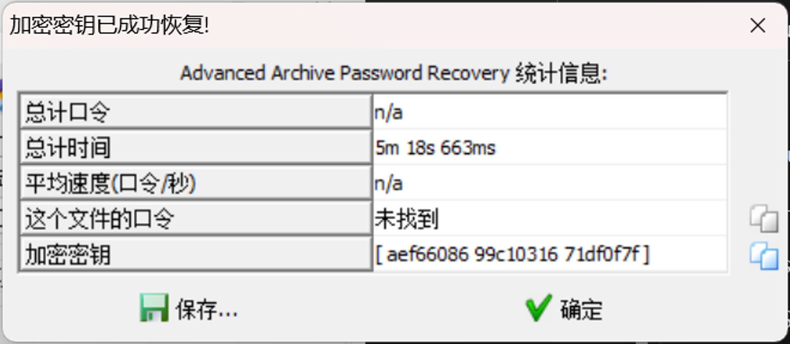

随后提取flag

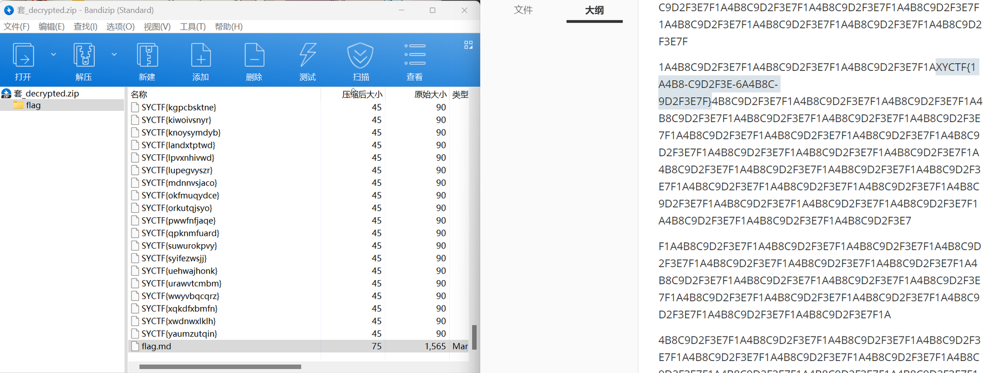

### 熊博士

CBXGU{ORF_BV_NVR_BLF_CRZL_QQ}

给了段文本，我们知道flag以XYCTF开头,对比一下发现只是把字母表逆向单表替代

代码如下：

~~~python
dic = {chr(i+65):chr(65+(25-i)) for i in range(26)}

enc_flag = r"CBXGU{ORF_BV_NVR_BLF_CRZL_QQ}"

for i in enc_flag:
    if i == "{" or i == "}" or i == "_": print(i,end="")
    else: print(dic[i],end="")
    
#XYCTF{LIU_YE_MEI_YOU_XIAO_JJ}
~~~

### TCPL

丢到linux直接运行发现打不开，file后发现是64位的RISC-V程序，所以只需配个qemu环境即可

    ELF 64-bit LSB pie executable, UCB RISC-V, RVC, double-float ABI, version 1 (SYSV), dynamically linked, interpreter /lib/ld-linux-riscv64-lp64d.so.1, BuildID[sha1]=97853ab52c6dc9a68d68295c7ec62cc790905b3d, for GNU/Linux 4.15.0, not stripped

    FLAG{PLCT_An4_r0SCv_x0huann0}

## Reverse

### 聪明的信使

32位，无壳，找到加密函数

简单的单表替代，脚本如下

~~~py
enc_flag = "oujp{H0d_TwXf_Lahyc0_14_e3ah_Rvy0ac@wc!}"
flag = ""

for i in enc_flag:
    if 65 <= ord(i) and ord(i) <= 90:
        flag += chr((ord(i)-9-65)%26 + 65)
    elif 97 <= ord(i) and ord(i) <= 122:
        flag += chr((ord(i)-9-97)%26 + 97)
    else:
        flag += i

print(flag)#flag{Y0u_KnOw_Crypt0_14_v3ry_Imp0rt@nt!}
~~~

### 喵喵喵的flag碎了一地

64位 无壳 IDA打开

shift+F12查看字符串，找到第一部分flag

在旁边的funtion name栏找到第二部分flag

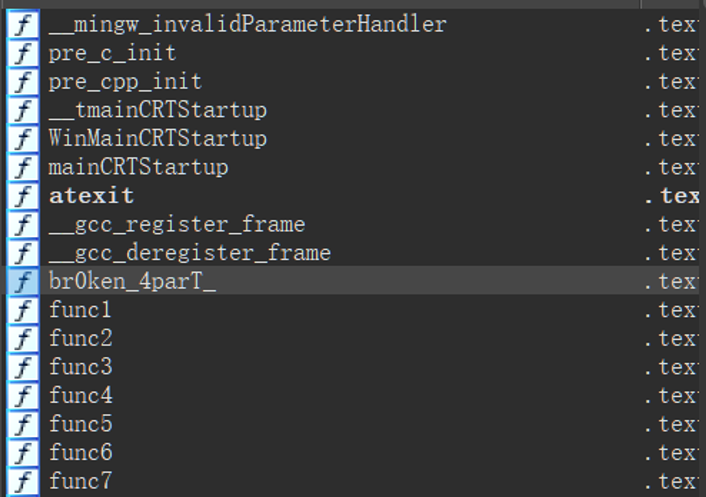

对br0ken_4parT_使用ctrl+x寻找引用找到第三第四部分flag

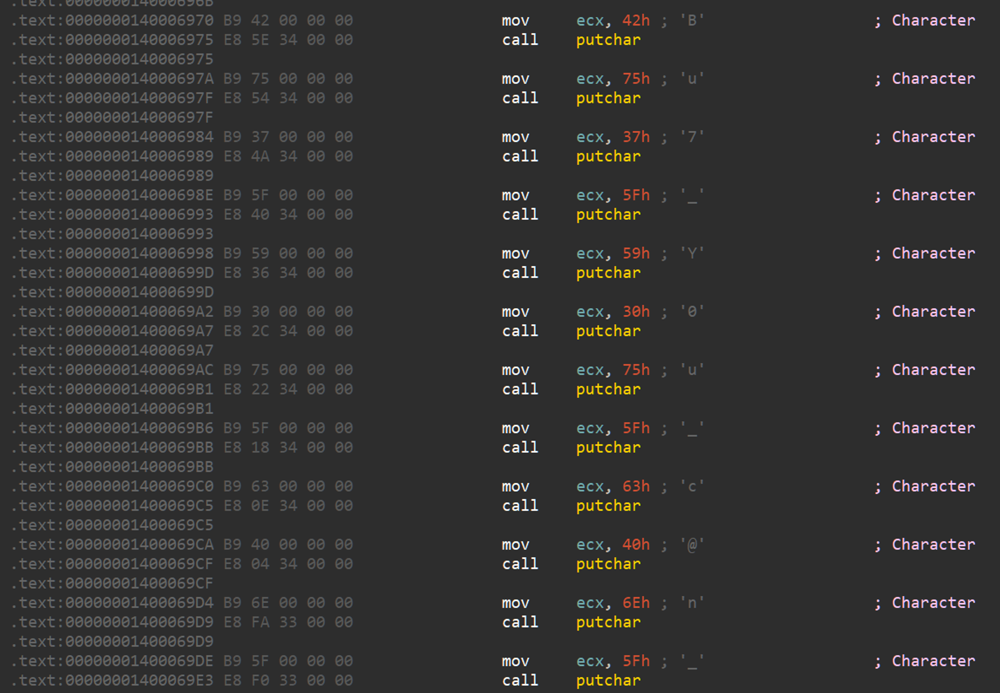

    flag{My_fl@g_h4s_br0ken_4parT_Bu7_Y0u_c@n_f1x_1t!}

### 你是真的大学生吗？

在wsl里file一下

发现是MS-DOS程序也就是8086汇编，使用IDA打开

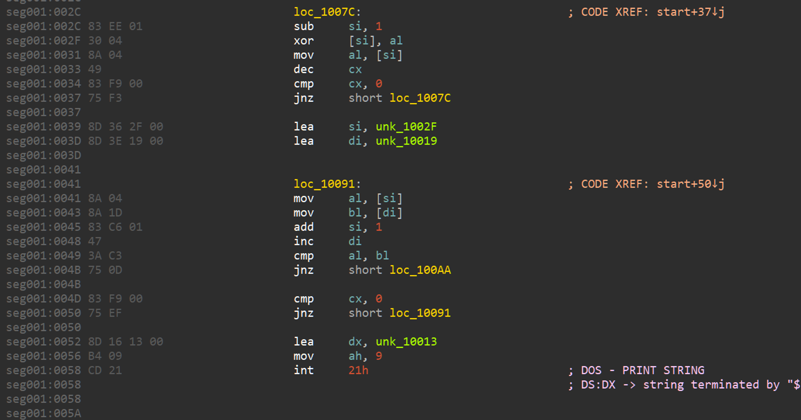

定位到关键代码，发现是从最后一个字符开始逆向与后面一个字符进行异或（最后一个字符和第一个异或），脚本如下

~~~py
enc_flag = [0x76, 0x0E, 0x77, 0x14, 0x60, 0x06, 0x7D, 0x04, 0x6B, 0x1E, 
  0x41, 0x2A, 0x44, 0x2B, 0x5C, 0x03, 0x3B, 0x0B, 0x33, 0x05]

tmp = enc_flag[0] 
for i in range(0,len(enc_flag)-1):
    enc_flag[i] ^= enc_flag[i+1]
enc_flag[-1] ^= enc_flag[0]

print(*list(map(chr,enc_flag)),sep="")#xyctf{you_know_8086}
~~~

### DebugMe

apk丢入JEB，查看MainActivity

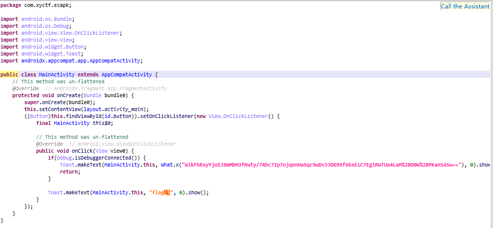

发现进入debug后会输出flag

## Pwn

### hello_world

先checksec一下

amd64程序，开了NX和PIE，丢IDA

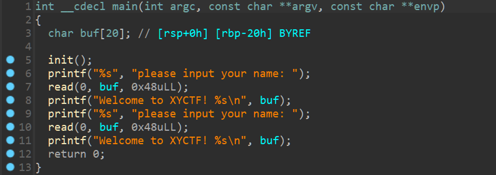

给了两次溢出机会，且程序内不自带system和/bin/sh，所以猜想ret2libc，第一次泄露rbp+8上的返回地址，即使用0x28长度的padding覆盖buf和old_ebp,代码如下

运行结果如下：

vmmap发现这个指令是libc上的一段区域，于是可以计算偏移为0x29d90

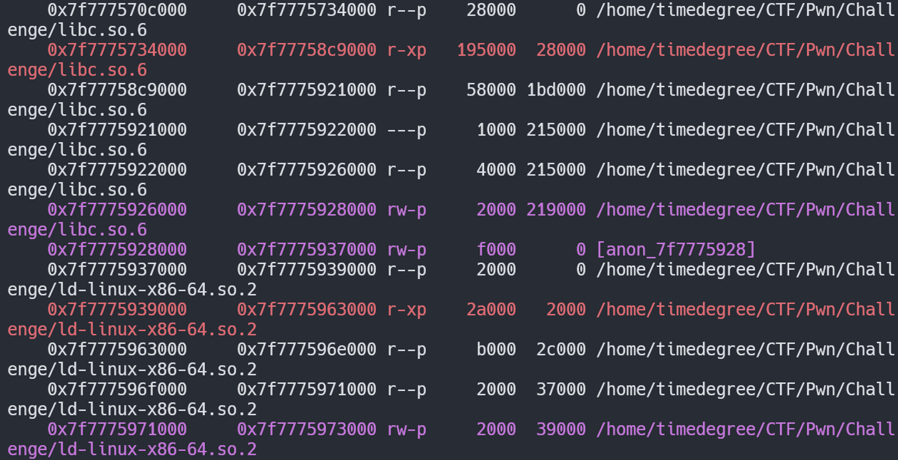

接着使用libc中的gadget构造rop链，完整exp如下

结果如下：

### static_link

checksec发现开了NX和Canary,但查看汇编代码发现，并没有取fs:[0x28]的值也未做比较，所以当它不存在。打开IDA进入vuln

使用了静态链接，猜测为ret2syscall,不存在/bin/sh和system，手动构造execve(”/bin/sh”,0,0)

1. 寻找可写数据区域，将rsi指向该区域并再次调用read
2. 修改rax为59，rdi为/bin/sh的地址，rsi=rdx=0
3. 输入/bin/sh

exp如下:

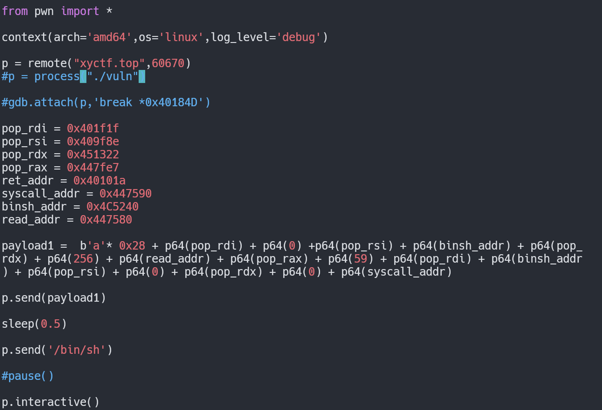

运行结果如下：

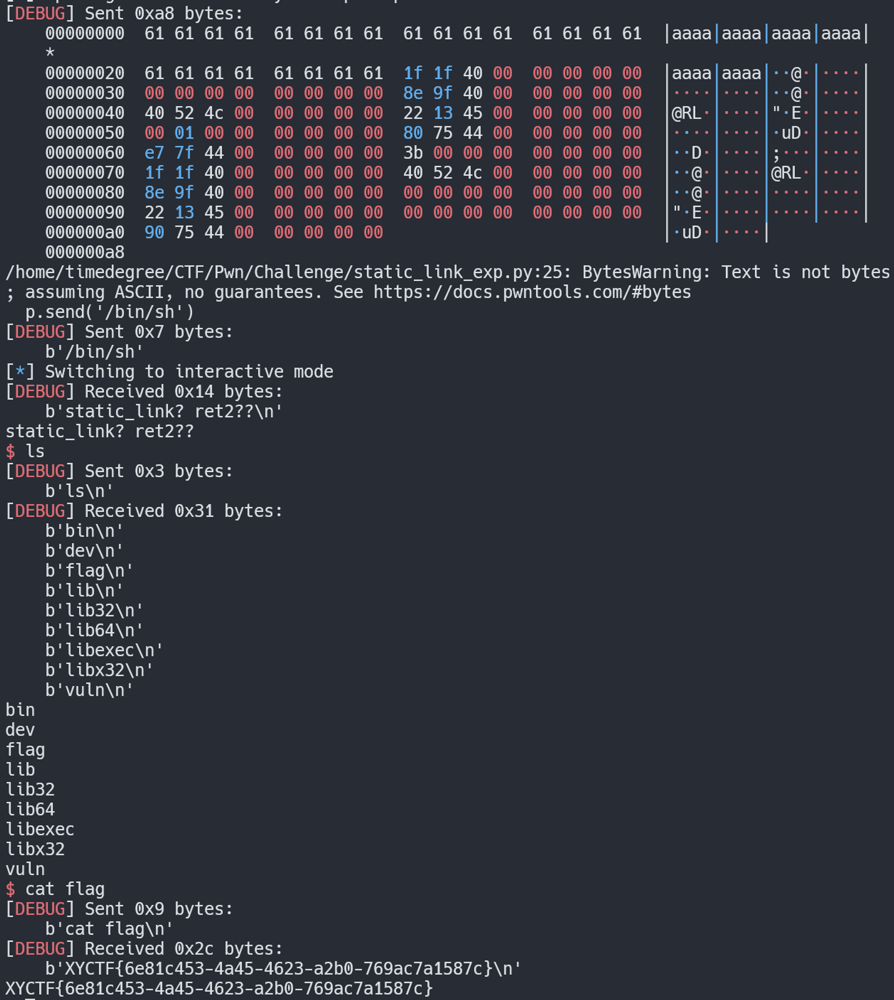

### guestbook1

checksec只开NX，丢入IDA

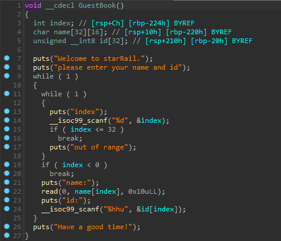

发现存在数组越界漏洞和backdoor，id可控制rbp的最低字节，猜测为伪造rbp，并构栈滑板使得退栈时返回地址为backdoor，exp如下：

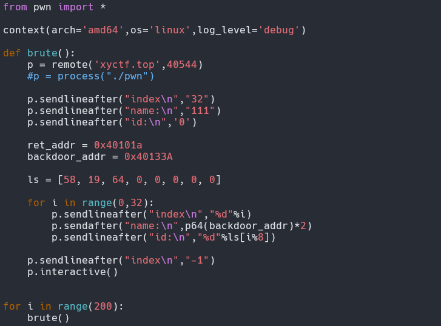

运行结果如下：

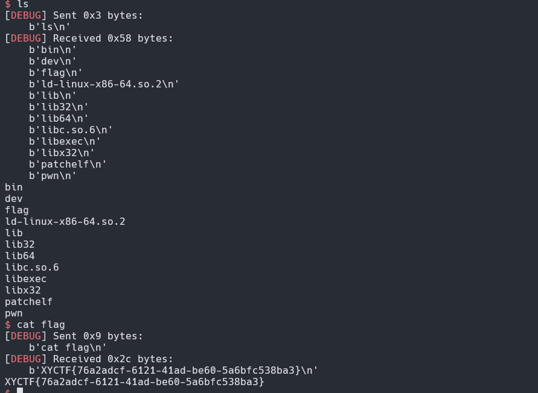

### invisible_flag

一道orw，沙箱如下

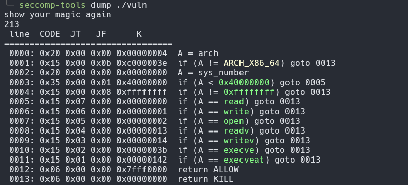

选择使用openat打开文件，sendfile输出，exp如下：

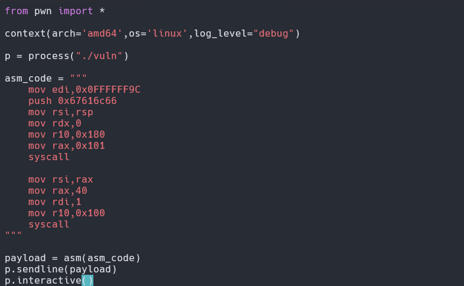

远程靶机打不开暂时不放结果