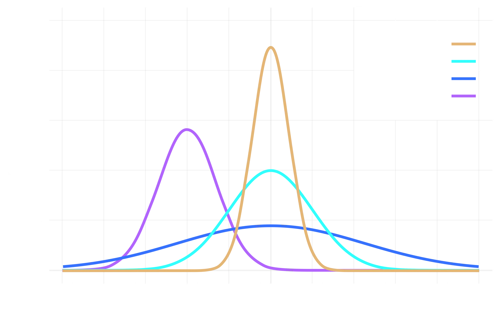

# 随机变量及其分布

## 随机变量

### 定义

若 $\forall e \in S$ ，都有唯一确定的实数 $X(e)$ 和它对应，则称单值实函数 $X = X(e)$  在定义在 $S$ 上的随机变量，记为 $r.v$

### 与普通函数的区别

1. 定义域为样本空间 $S$
2. 取值在试验前不定
3. 随机变量的取值具有一定的概率规律

### 分类

- 离散型 随机变量的所有可能取值为有限个或可列个
- 非离散型
    - 连续型 随机变量的所有可能取值可以连续充满某个区域
    - 其他

## 离散型随机变量及其分布律

### 分布律

#### 定义

设 $X$ 为离散型随机变量， $X$ 所有可能取值为 $X_k(k=1,2,\cdots)$ 且 $P\{X=X_k\} = p_k$，则称 $P(X=X_k) = p_k$ 为 $X$ 的分布律，也可以分布列表示

| $X$ | $x_1$ | $x_2$ | $\cdots$ | $x_k$ | $\cdots$ |
| --- | --- | --- | --- | --- | --- |
| $P$ | $p_1$ | $p_2$ | $\cdots$ | $p_k$ | $\cdots$ |

### 分布律成立的充要条件

- $p_k \ge 0, k = 1,2,\cdots$
- $\sum_{k=1}^{\infin} p_k =1$

### 三种常用分布

#### $0-1$ 分布

定义：若随机变量中的分布律为

| $X$ | $0$ | $1$ |
| --- | --- | --- |
| $P$ | $1-p$ | $p$ |

则称 $X$ 服从参数为 $p$ 的 $0-1$ 分布

#### 二项分布

- 伯努利试验：试验 $E$ 的结果只有两个 $A$ 和 $\overline{A}$ 且 $P(A) = p (0<p<1)$ 和 $P(\overline{A}) = 1-p$
- $n$ 重伯努利试验：独立重复 $n$ 次伯努利试验

!!! tip
    - $P(A) = P$ 保持不变
    - 每次试验结果互不影响

- 二项概率公式：若 $X$ 为 $n$ 重伯努利试验中事件 $A$ 发生的概率

$$
P\{X=k\} = \binom{n}{k} p^k q^{n-k} ,k=0,1,2,\cdots,n
$$

1. 二项分布
- 定义：若随机变量 $X$ 的分布律为 $P\{X=k\} = \binom{n}{k} p^k q^{n-k} (k=0,1,\cdots,n)$，其中 $0<p<1,q=1-p$，则称 $X$ 服从参数为 $n,p$ 的二项分布，记作 $X \sim B(n,p)$
- 其分布列如下

| $X$ | $0$ | $1$ | $\cdots$ | $n$ |
| --- | --- | --- | --- | --- |
| $P_k$ | $q^n$ | $\binom{1}{n}p\cdot q^{n-1}$ | $\cdots$ | $p^n$ |

#### 泊松分布

- 定义：若随机变量 $X$  的分布律为 $P\{X=k\} = \frac{\lambda^ke^{-\lambda}}{k!}(k=0,1,\cdots)$，其中 $\lambda > 0$  为常数，则称 $X$ 服从参数为 $\lambda$ 的泊松分布，记作 $X \sim \pi(\lambda)$
- 合理性
    1. $\frac{\lambda^ke^{-\lambda}}{k!} \ge 0$
    2. $\sum_{k=0}^{\infin} \frac{\lambda^ke^{-k}}{k!} = e^{-\lambda} \sum_{k=0}^{\infin} \frac{\lambda^k}{k!}= e^{\lambda}e^{-\lambda} = 1$  
- 背景：通常用于描述在给定时间或空间内随机独立事件发生次数的概率，其极小但有一定规律性
- 泊松定理：设 $\lambda >0$ 是一个常数，$n$ 为任意正整数，设 $np_n  = \lambda$ ，则对于任一固定的非负整数 $k$ 有

$$
\lim_{n\to \infin} \binom{n}{k} p_n^k(1-p_n)^{n-k} = \frac{\lambda^ke^{-\lambda}}{k!}
$$

即 $P\{X = k\} = \binom{n}{k} p^k (1-p)^{n-k} \approx \frac{\lambda^ke^{-\lambda}}{k!} (\lambda = np)$

!!! tip
    一般 $n \ge 20,p\le 0.05$ 时，可用泊松定理对二项分布进行近似

## 随机变量的分布函数

### 分布函数

#### 定义

设 $X$ 为一个随机变量，$x$ 为任意实数，函数

$$
F(x) = P\{X \le x\}，x \in (-\infin,+\infin)
$$

称为 $X$ 的分布函数

#### 性质

1. $F(x)$ 为不减函数
2. $0 \le F(x) \le 1$  ，特別的，$F(-\infin) = \lim_{x\to -\infin} F(x) = 0$ 以及 $F(+\infin) = \lim_{x\to +\infin} F(x) = 1$
3. $F(x)$  一定右连续

!!! tip
    - $F(x)$ 的定义域为 $R$
    - $F(x)$ 的值即 $\{X\le x\}$ 发生的概率
    - $P\{x_1 \le X \le x_2\} = F(x_2) - F(x_1)$

### 离散型随机变量的分布函数

1. $F(x) = P\{X \le x\} = \sum_{x_k\le k} P\{X = x_k\}$
2. $X$ 的可能取值 $x_k$ 是 $F(x)$ 的跳跃间断点，其跃度为 $p_k$

## 连续型随机变量及其概率密度

### 概率密度

#### 定义

设 $X$ 是在实数域或区间上连续取值的随机变量，其分布函数可表示为 $F(x) = \int_{-\infin}^{x} f(t) dt$ ，其中 $f(t)$ 为非负可积函数，则称 $X$ 为连续型随机变量，$f(x)$ 为 $X$ 的概率密度函数

#### 性质

1. $f(x) \ge 0$
2. $\int_{-\infin}^{+\infin}f(x)\mathrm{d}x = 1$
3. $P\{x_1 < X \le x_2\} = F(x_2) - F(x_1) = \int_{x_1}^{x_2} f(x)\mathrm{d}x$
4. $F'(x) = f(x)$

!!! tip
      - 概率密度刻画了随机变量在 $f(x)$ 的连续点 $x$ 附近取值概率的大小
      - 若 $X$ 为连续型随机变量，则 $\forall x \in R,P\{X=a\} = 0$
      - $P\{a<x<b\} = P\{a\le x <b\} = P\{a < x \le b\} = P\{a \le x \le b\}$

### 常见的连续型分布

#### 均匀分布

- 定义：若连续型随机变量 $X$ 的概率密度函数为

$$
f(x)=\left\{
\begin{array}{l}
\frac{1}{b-a},a<x<b \\
0,\quad \text{otherwise} 
\end{array}
\right.
$$

则称 $X$ 在区间 $(a,b)$  上服从均匀分布，记为 $X \sim U(a,b)$. 易知 $f(x) \ge 0$  且 $\int_{-\infin}^{+\infin} f(x) \mathrm{d}x =1$

- 性质：落在区间 $[a,b]$ 中任一等长度的子区间概率相同
- 分布函数：

$$
F(x) = \left\{
\begin{array}{l}
0,x<a \\ \frac{x-a}{b-a},a\le x \le b \\ 1,x>b
\end{array}
\right.
$$

#### 指数分布

- 定义：若连续型随机变量 $X$ 的概率密度函数为

$$
f(x) = \left\{
\begin{array}{l}
\frac{1}{\theta}e^{-\frac{x}{\theta}},x>0 \\
0,\quad \text{otherwise} 
\end{array}
\right.
$$

其中 $\theta >0$，则称 $X$ 服从参数为 $\theta$ 的指数分布，记为 $X \sim e(\theta)$. 易知 $f(x) \ge 0$  且 $\int_{-\infin}^{+\infin} f(x) \mathrm{d}x = \int_{-\infin}^{0} 0 \mathrm{d}x + \int_{0}^{+\infin}\frac{1}{\theta}e^{-\frac{x}{\theta}}\mathrm{d}x = 1$

- 分布函数

$$
F(x) = \left\{
\begin{array}{l}
1- e^{-\frac{x}{\theta}},x>0\\
0,\quad \text{otherwise} 
\end{array}
\right.
$$

!!! tip
    - $f(x) \ge 0$
    - 无记忆性，即 $P\{x\ge s +t|x>s\} = P\{x > t\}$

#### 正态分布

- 定义：设连续型随机变量 $X$ 的概率密度函数为

$$
f(x)=\frac{1}{\sqrt{2\pi}\sigma}e^{-\frac{(x-\mu)^2}{2\sigma^2}}
$$

其中 $\mu,\sigma(\sigma>0)$ 为常数，则称 $X$ 服从参数 $\mu,\sigma$ 的正态分布，记作 $X \sim N(\mu,\sigma^2)$. 易知$f(x)\ge0$ 且 $\int_{-\infin}^{+\infin}\frac{1}{\sqrt{2\pi}\sigma}e^{-\frac{(x-\mu)^2}{2\sigma^2}}\mathrm{d}x = \int_{-\infin}^{+\infin} \frac{1}{\sqrt{2\pi}} e^{-\frac{t^2}{2}}\mathrm{d}t (t = \frac{x-\mu}{\sigma}) = \sqrt{2\pi} \cdot \frac{1}{\sqrt{2\pi}} = 1$

!!! tip
    $$
    \int_{-\infin}^{+\infin} e^{-a^2x^2} \mathrm{d}x = \frac{\sqrt{\pi}}{a} (a>0)
    $$

- 几何性质：
    1. 曲线 $y=f(x)$ 关于 $x = \mu$ 对称
    2. 当 $x< \mu$ 时单调递增，当 $x > \mu$ 时单调递减，在 $x = \mu$ 处取最大值 $\frac{1}{\sqrt{2\pi}\sigma}$
    3. 曲线 $y = f(x)$ 在 $x = \mu \pm \sigma$ 处有拐点
    4. $x$ 轴水平渐近线
    5. $\mu$ 决定位置，$\sigma$ 决定形状，$\mu$ 不变，$\sigma$ 越大，曲线越扁

- 标准正态分布：当 $\mu = 0,\sigma = 1$ 时，称为标准正态分布，记作 $X \sim N(0,1)$
    - 概率密度：$\varphi(x) =  \frac{1}{\sqrt{2\pi}} e^{-\frac{x^2}{2}} ,x \in (-\infin,+\infin)$
    - 分布函数： $\Phi(x) = \int_{-\infin}^{x}\frac{1}{\sqrt{2\pi}} e^{-\frac{x^2}{2}} \mathrm{d}x$
    - 性质
        1. $\varphi (-x) = \varphi(x)$ 
        2. $\Phi (-x) = 1 - \Phi(x)$
- 引理：若随机变量 $X \sim N(\mu,\sigma^2)$ ，则 $Z = \frac{x - \mu}{\sigma} \sim N(0,1)$,可得
    - $F(x)=P\{X \le x\} = P\{\frac{X-\mu}{\sigma}\le \frac{x-\mu}{\sigma}\} = \Phi(\frac{x-\mu}{\sigma})$
    - $P\{a < x \le b\} = P\{\frac{a-\mu}{\sigma} < \frac{x-\mu}{\sigma} \le \frac{b-\mu}{\sigma}\} = \Phi(\frac{b-\mu}{\sigma}) - \Phi(\frac{a-\mu}{\sigma})$
- $3\sigma$ 原则：
    - $P\{\mu - \sigma < x \le \mu + \sigma\} = \Phi(1) - \Phi(-1) = 68.26\%$
    - $P\{\mu - 2\sigma < x \le \mu + 2\sigma\} = \Phi(2) - \Phi(-2) = 95.44\%$
    - $P\{\mu - 3\sigma < x \le \mu + 3\sigma\} = \Phi(3) - \Phi(-3) = 99.74\%$

## 随机变量的函数的分布

已知 $X$ 的分布，求 $Y = g(X)$ 

### 离散型随机变量的函数的分布

若 $X$ 为离散型随机变量，则函数 $Y = g(X)$ 为离散型随机变量，$X$  分布律为

| $X$ | $x_1$ | $x_2$ | $\cdots$ | $x_k$ | $\cdots$ |
| --- | --- | --- | --- | --- | --- |
| $P$ | $p_1$ | $p_2$ | $\cdots$ | $p_k$ | $\cdots$ |

则 $Y = g(X)$ 的分布律为

| $Y$ | $g(x_1)$ | $g(x_2)$ | $\cdots$ | $g(x_k)$ | $\cdots$ |
| --- | --- | --- | --- | --- | --- |
| $P$ | $p_1$ | $p_2$ | $\cdots$ | $p_k$ | $\cdots$ |

若 $g(x_k)$  中有值相同，则将概率合并

### 连续型随机变量的函数的分布

!!! tip
    - $F(x) = \int_{g(y)}^{h(y)} f(x)\mathrm{d}x$
    - $F'(x) = f(h(y))h'(y) - f(g(y))g'(y)$

#### 求连续型随机变量函数的概率密度方法

- 分布函数法
    1. 由 $X$  的概率密度函数确定 $Y$ 的取值
    2. 建立 $Y$  的分布函数 $F_Y(y) = P\{Y\le y\} = P\{g(X) < y\}$
    3. 通过事件的等价交换转化为用 $X$ 的分布函数表示 $P\{Y \le y\}$
    4. 对 $F_Y(y)$ 求导得 $f_Y(y)$
- 公式法

设 $X$ 为连续型随机变量，其概率密度 $f_X(x)(x \in (-\infin,+\infin))$. $y = g(x)$ 是一处可导且严格单调的函数，则 $Y=g(X)$ 为连续型随机变量，其概率密度为

$$
f_Y(y) = \left\{
\begin{array}{l}
f_X[h(y)]|h'(y)|,\alpha < y < \beta\\
0,\quad \text{otherwise} 
\end{array}
\right.
$$

若 $f_X(x)$ 在 $[a,b]$ 以外全为 0，则只需 $g(x)$ 在 $[a,b]$ 是恒有 $g'(x) > 0$ 或 $g'(x) < 0$,此时

$$
\begin{array}{l}
\alpha = min\{g(a),g(b)\}\\
\beta = max\{g(a),g(b)\}
\end{array}
$$